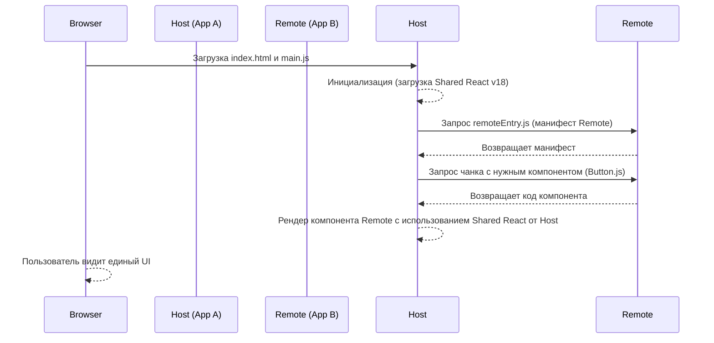

# Module Federation: Динамическая сборка на лету

В мире микрофронтендов долгое время существовала дилемма: как шарить код между независимыми приложениями без боли? До 2020 года мы либо паковали общие UI-компоненты в npm-пакеты (и пересобирали *все* приложения при каждом обновлении кнопки), либо загружали их через глобальные переменные (`window`), молясь, чтобы версии React не подрались в рантайме.

Появление **Module Federation** (MF) в Webpack 5 изменило правила игры. Это архитектурный паттерн и технология, которая позволяет загружать скомпилированный код из одного приложения в другое прямо во время выполнения (в рантайме), при этом умно управляя общими зависимостями.

## Как это работает: Host, Remote и Shared

Концепция строится на трех китах:
1. **Host** — приложение-хозяин, которое загружается первым и подтягивает другие модули.
2. **Remote** — приложение-донор, которое экспортирует часть своего кода (компоненты, функции, сторы), чтобы их мог использовать Host. Любое приложение может быть одновременно и Host, и Remote.
3. **Shared** — механизм управления общими зависимостями (например, `react`, `react-dom`). Если и Host, и Remote используют React одной версии, MF загрузит его только один раз.



## Пример конфигурации

Вся магия происходит на уровне конфигурации бандлера (исторически Webpack, сейчас поддерживается Rspack и Vite).

**Как надо: Конфиг Remote (Донора)**
```javascript
// webpack.config.js (Remote - "CartApp")
const ModuleFederationPlugin = require('webpack/lib/container/ModuleFederationPlugin');

module.exports = {
  plugins: [
    new ModuleFederationPlugin({
      name: 'cart', // Имя микрофронтенда
      filename: 'remoteEntry.js', // Файл-манифест
      exposes: {
        './CartWidget': './src/components/CartWidget', // Что отдаем наружу
      },
      shared: {
        react: { singleton: true, requiredVersion: '^18.0.0' },
        'react-dom': { singleton: true, requiredVersion: '^18.0.0' },
      },
    }),
  ],
};
```

**Как надо: Конфиг Host (Хозяина)**
```javascript
// webpack.config.js (Host - "ShellApp")
const ModuleFederationPlugin = require('webpack/lib/container/ModuleFederationPlugin');

module.exports = {
  plugins: [
    new ModuleFederationPlugin({
      name: 'shell',
      remotes: {
        // 'имя_в_коде': 'имя_в_remote@url/remoteEntry.js'
        cart: 'cart@https://cart.example.com/remoteEntry.js',
      },
      shared: {
        react: { singleton: true, eager: true },
        'react-dom': { singleton: true, eager: true },
      },
    }),
  ],
};
```

*Антипаттерн:* Игнорирование `singleton: true` для библиотек с глобальным стейтом (React, Vue). Если не указать этот флаг, MF может загрузить две разные копии React, что приведет к знаменитой ошибке "Invalid hook call" или дублированию контекстов.

## Скрытые трейдоффы и границы применимости

Module Federation выглядит как серебряная пуля для микрофронтендов, но у нее есть свои темные стороны.

### Где применимо и блистает
- **Крупные Enterprise-порталы**: где над разными частями UI работают десятки независимых команд.
- **Частые релизы UI-компонентов**: обновление дизайн-системы или хедера в Remote-приложении мгновенно отражается на всех Host-приложениях без их пересборки.
- **A/B тестирование**: можно динамически подменять URL для `remoteEntry.js` в зависимости от пользователя.

### Где ломается (Трейдоффы)
1. **Хрупкость рантайма (Single Point of Failure)**: Если сервер, раздающий `remoteEntry.js` для корзины, упадет — может лечь все приложение-хост, если не настроены предохранители (Error Boundaries) и фоллбеки.
2. **Ад зависимостей (Dependency Hell 2.0)**: Разрешение конфликтов версий в `shared` происходит в рантайме. Если Host требует React 18, а Remote жестко завязан на React 16 и не допускает шаринга, бандл раздуется, так как загрузятся обе версии.
3. **Сложность отладки**: Трейсинг ошибок превращается в квест. Стек-трейс может указывать на загадочные чанки из другого домена. Инструментарий для типизации (TypeScript) между Host и Remote требует дополнительных костылей (например, `@module-federation/typescript` или генерации `.d.ts` файлов в npm-пакет).
4. **Сетевой оверхед**: Host сначала скачивает манифест `remoteEntry.js`, парсит его, и только потом понимает, какие чанки с кодом нужны. Это создает цепочку последовательных сетевых запросов, увеличивая время до первого рендера (TTI/FCP), если не применять префетчинг.

**Резюме:** Module Federation переносит сложность интеграции с этапа сборки (build-time) на этап выполнения (run-time). Это дает невероятную гибкость независимых деплоев, но требует высочайшей инженерной культуры, строгого версионирования общих библиотек и надежного мониторинга.
