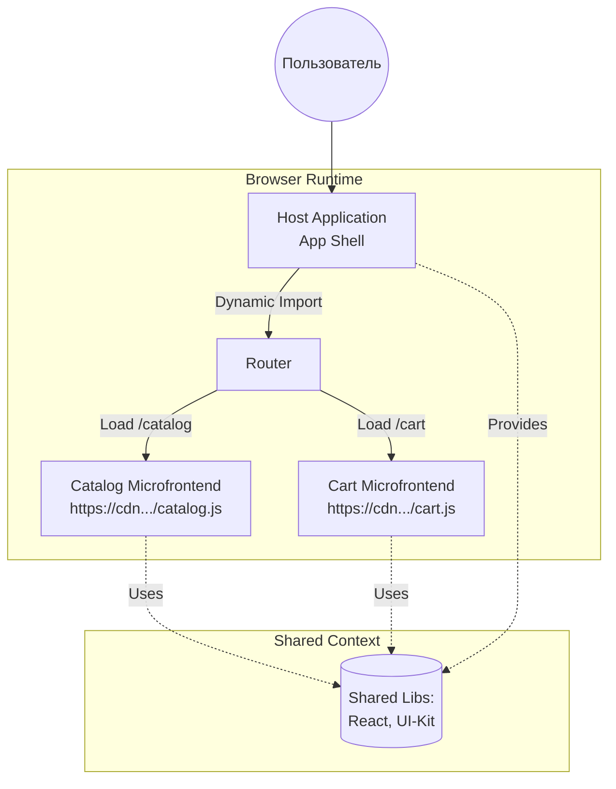

# Run-Time Integration в Микрофронтендах

Представьте, что вы строите огромный маркетплейс. У вас есть команда корзины, команда каталога и команда чекаута. Если объединять их код на этапе сборки (Build-time integration), то каждый релиз корзины будет требовать пересборки всего приложения. Это долго, больно и убивает саму идею независимых команд. 

Здесь на сцену выходит **Run-Time Integration** (интеграция во время выполнения) — подход, при котором микрофронтенды объединяются в единое приложение прямо в браузере пользователя в момент загрузки страницы.

## Как это работает?

Вместо того чтобы тянуть зависимости через NPM и собирать один большой бандл, **Host-приложение** (или Shell) динамически запрашивает код **Remote-приложений** (микрофронтендов) по сети. 

Самый популярный стандарт де-факто для этого сегодня — **Module Federation** (появился в Webpack 5, теперь поддерживается Rspack, Vite и др.).



## Анатомия решения (на примере Module Federation)

Главная магия Module Federation — способность шарить зависимости. Если Host и Remote используют один и тот же `react` одной версии, Remote не будет загружать свой, а использует тот, что уже есть в памяти.

### Как надо: Настройка Host и Remote

**Remote (Корзина):** Экспортирует свой компонент наружу.
```javascript
// webpack.config.js (Remote)
new ModuleFederationPlugin({
  name: 'cart',
  filename: 'remoteEntry.js',
  exposes: {
    './CartWidget': './src/components/CartWidget',
  },
  shared: { react: { singleton: true, requiredVersion: '^18.0.0' } },
});
```

**Host (Shell):** Импортирует удаленный компонент как обычный ленивый модуль.
```javascript
// App.jsx (Host)
import React, { Suspense } from 'react';

// Динамический импорт по сети!
const CartWidget = React.lazy(() => import('cart/CartWidget'));

function App() {
  return (
    <div>
      <h1>Мой Магазин</h1>
      <Suspense fallback={<div>Загрузка корзины...</div>}>
        <CartWidget />
      </Suspense>
    </div>
  );
}
```

### Антипаттерн: "Зоопарк фреймворков"
Некоторые воспринимают Run-Time интеграцию как карт-бланш на использование Angular, React и Vue на одной странице. Технически это возможно (например, оборачивая всё в Web Components), но на практике это приводит к загрузке 5 мегабайт бандлов, тормозам и боли при обмене данными между компонентами. Микрофронтенды — это про независимость команд, а не про хаос в стеке.

## Скрытые трейдоффы и границы применимости

Run-Time интеграция дает невероятную гибкость (независимые деплои), но требует платить за нее архитектурной сложностью:

1. **Network Point of Failure:** Если CDN с Remote-модулем упал, часть вашего интерфейса отвалится прямо в рантайме. Необходимы надежные Fallback-UI (Error Boundaries).
2. **Фантомные баги зависимостей:** Shared-зависимости (Singleton) могут сыграть злую шутку. Если Host требует React 18, а Remote был собран под React 17 и не может работать с 18, вы получите ошибку в рантайме, которую не отловит TS или CI/CD.
3. **Отсутствие статической типизации:** TypeScript из коробки ничего не знает про типы модуля `cart/CartWidget`, загружаемого по сети. Приходится настраивать автоматическую генерацию и публикацию `.d.ts` файлов в общий registry (например, через `@module-federation/typescript`).
4. **Сложность SSR:** Server-Side Rendering с микрофронтендами, загружаемыми в рантайме — это задача со звездочкой. Node.js должен уметь резолвить удаленные бандлы на сервере.

### Когда применять?
- Крупные продукты с 3+ независимыми кросс-функциональными командами.
- Необходимость деплоить фичи (например, новую корзину) без пересборки всего портала.
- Системы с развитой платформенной командой, которая может скрыть сложность настройки от продуктовых разработчиков.

### Когда сломается?
- В стартапах или маленьких командах (до 15 разработчиков) — вы потратите больше времени на инфраструктуру, чем на фичи.
- В B2C продуктах, где критичен идеальный TTI (Time to Interactive) и жесточайший SEO, а команда не готова инвестировать месяцы в настройку Module Federation + SSR. В таких случаях лучше использовать Build-time integration (NPM-пакеты) или монолит.
