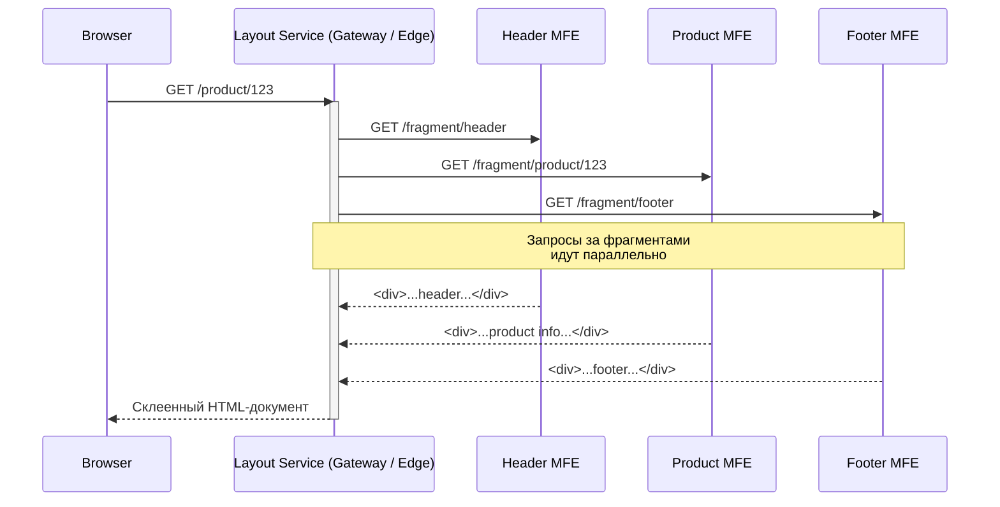

# Server-Side Composition (Композиция на сервере)

**Что это?**
Серверная композиция (Server-Side Composition, SSC) — это архитектурный паттерн микрофронтендов, при котором сборка финальной HTML-страницы из независимых фрагментов (микрофронтендов) происходит на стороне сервера (или на уровне Edge/CDN) до того, как ответ уйдёт в браузер пользователя.

**Какую боль решаем?**
Клиентская композиция (через iframe, Web Components или чистый Module Federation) часто приводит к проблемам производительности: браузеру нужно загрузить пустую оболочку, затянуть JS основного приложения, затем скачать JS-бандлы микрофронтендов, и только потом сделать запросы за данными и отрендерить UI. Это убивает First Contentful Paint (FCP) и ставит крест на SEO. SSC решает эту боль, отдавая клиенту готовый, семантический HTML.

**Как это работает?**
Специальный сервис-маршрутизатор (Gateway, Layout Service или балансировщик) перехватывает запрос от браузера. Он загружает каркас страницы (шаблон) и параллельно запрашивает HTML-фрагменты у нижестоящих независимых сервисов (микрофронтендов). Получив все кусочки, он "склеивает" их в единый документ.



**Классика: Edge Side Includes (ESI)**
Один из старейших способов — использование ESI. Этот стандарт поддерживается многими кэширующими прокси (например, Varnish, Nginx).
Шаблон страницы выглядит так:

```html
<!DOCTYPE html>
<html lang="ru">
<head>
    <title>Страница товара</title>
</head>
<body>
    <!-- Nginx или Varnish подменят этот тег на ответ от сервиса -->
    <esi:include src="http://header-service/api/fragment" />
    
    <main>
        <esi:include src="http://product-service/api/fragment/123" />
    </main>
    
    <esi:include src="http://footer-service/api/fragment" onerror="continue" />
</body>
</html>
```

**Современный подход: Node.js и HTML Streaming**
Вместо декларативного ESI сегодня часто используют программную композицию на Node.js (например, **Podium**, **Zalando Tailor** или собственные Gateway-сервисы).

*Антипаттерн: Синхронное ожидание (Waterfall)*
Ждать загрузки всех фрагментов перед началом отдачи ответа — плохая идея. Самый медленный микрофронтенд замедлит всю страницу (TTFB).

```javascript
// ❌ АНТИПАТТЕРН: Клиент увидит белый экран, пока не ответит самый медленный сервис
app.get('/product/:id', async (req, res) => {
    const [header, body, footer] = await Promise.all([
        fetch('http://header'),
        fetch(`http://product/${req.params.id}`),
        fetch('http://footer')
    ]);
    res.send(`<html>${header}${body}${footer}</html>`);
});
```

*Как надо: HTML Streaming*
Используйте потоковую передачу данных. Браузер начнет парсить и рендерить `<head>` и шапку, пока бэкенд еще ждет ответ от сервиса товаров.

```javascript
// ✅ КАК НАДО: Стримим куски по мере готовности (упрощенный пример)
app.get('/product/:id', (req, res) => {
    res.setHeader('Content-Type', 'text/html; charset=utf-8');
    res.write('<html><head>...</head><body>');
    
    fetchStream('http://header')
        .pipe(res, { end: false })
        .on('end', () => {
            fetchStream(`http://product/${req.params.id}`)
                .pipe(res, { end: false })
                .on('end', () => {
                    res.end('</body></html>');
                });
        });
});
```

**Скрытые трейдоффы и границы применимости**

- ✅ **SEO и производительность:** Идеально подходит для e-commerce (карточки товаров), медиа-порталов и любых публичных сайтов, где важна скорость первой отрисовки и индексация поисковиками.
- ✅ **Изоляция сбоев (Resilience):** Если сервис рекомендаций "лежит", Layout Service может отрендерить страницу без него или вставить fallback-контент (см. `onerror="continue"` в ESI).
- ❌ **Сложность кэширования:** Разные фрагменты имеют разный жизненный цикл. Шапка кэшируется на сутки, а цена товара — на минуту. Управлять этим на уровне единой страницы сложно.
- ❌ **Оживание (Hydration) и интерактивность:** Серверная композиция отдаёт статику. Чтобы элементы стали интерактивными, каждый микрофронтенд должен подтянуть свой JS и провести гидратацию в браузере. Это порождает проблему коммуникации фрагментов на клиенте (приходится добавлять Event Bus или Custom Events).
- ❌ **Дублирование зависимостей:** Если шапка и корзина используют React, при плохой настройке пользователь скачает React дважды. Требуется сложная оркестрация ассетов (например, Import Maps или Module Federation поверх SSR).
