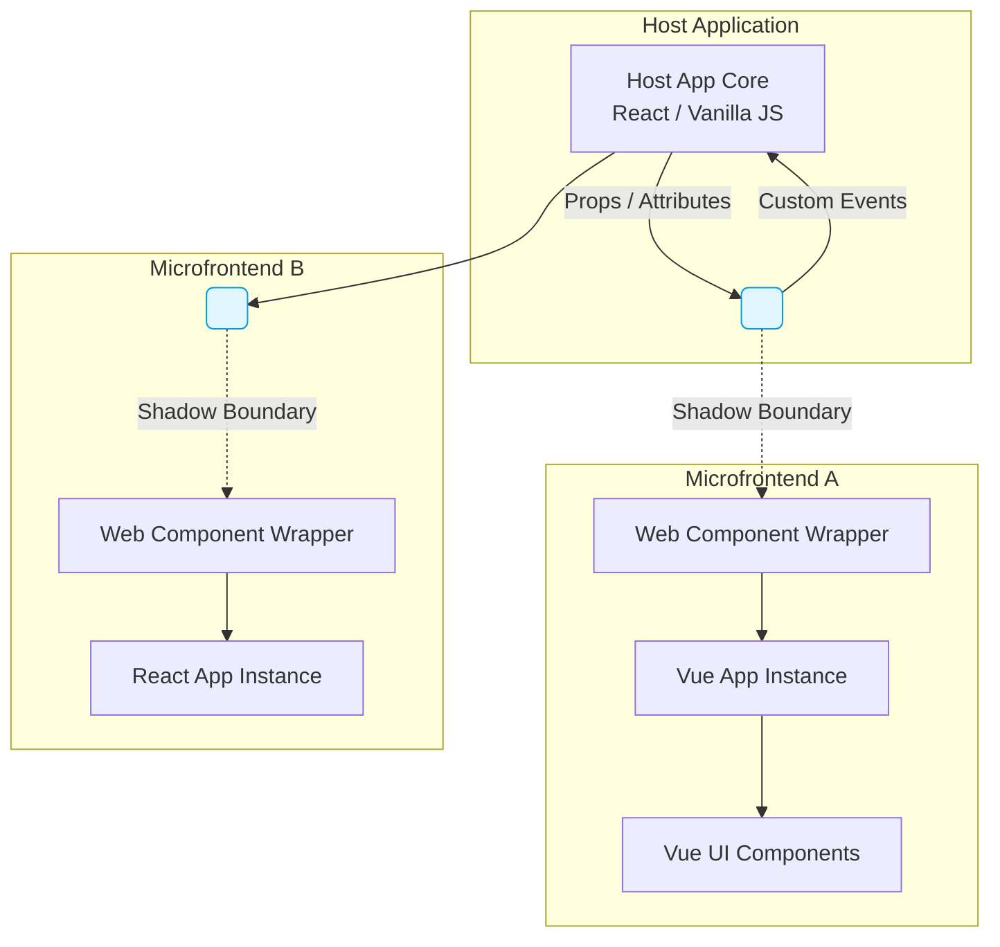

# Web Components в микрофронтендах

## Суть: Независимость любой ценой

Представьте, что вы строите огромный e-commerce портал. Корзину пишет команда на Vue, каталог — на React, а виджет рекомендаций — на Svelte. Каждая команда хочет развиваться в своем темпе, обновлять версии фреймворков и не думать о том, что их стили сломают соседний блок. 

В классическом монолите или при использовании глобальных `div`-контейнеров для микрофронтендов мы неизбежно сталкиваемся с утечкой стилей, конфликтами глобальных переменных и сильной связностью. **Web Components** решают эту боль на уровне браузерных стандартов. Они позволяют обернуть любое приложение (или его часть) в собственный HTML-тег с инкапсулированной логикой и стилями (Shadow DOM).

Для хостового приложения микрофронтенд превращается в черный ящик — обычный тег, вроде `<cart-widget></cart-widget>`, с которым можно общаться через стандартные атрибуты, свойства и Custom Events.

## Как это работает под капотом

В основе лежат три браузерных API:
1. **Custom Elements** — регистрация собственных HTML-тегов.
2. **Shadow DOM** — изоляция DOM-дерева и CSS. Стили внутри "тени" не утекают наружу, а внешние стили не ломают внутренности (кроме CSS-переменных).
3. **HTML Templates** — переиспользуемая разметка.



## Примеры кода

### Как надо: Изоляция и правильное общение

Правильный подход — использовать кастомный элемент как тонкую обертку (bootstrap) над вашим фреймворком. Общение наружу идет через генерацию кастомных событий, внутрь — через сеттеры свойств.

```javascript
// Микрофронтенд (на Vanilla JS или обертка над фреймворком)
class CartWidget extends HTMLElement {
  constructor() {
    super();
    // Открытый Shadow DOM для изоляции стилей
    this.attachShadow({ mode: 'open' });
  }

  connectedCallback() {
    this.shadowRoot.innerHTML = `
      <style>
        /* Эти стили не сломают хост-приложение */
        .cart { background: #fafafa; padding: 10px; }
      </style>
      <div class="cart">
        <h2>Корзина</h2>
        <button id="checkout-btn">Оформить</button>
      </div>
    `;

    // Инициализация фреймворка (React.render, createApp(Vue), etc.)
    // ...

    this.shadowRoot.getElementById('checkout-btn').addEventListener('click', () => {
      // Общение с хостом через CustomEvent
      this.dispatchEvent(new CustomEvent('checkout', { 
        detail: { total: 100 },
        bubbles: true,
        composed: true // Позволяет событию пробить границу Shadow DOM
      }));
    });
  }

  // Получение сложных данных от хоста через сеттер (не через HTML-атрибуты!)
  set cartItems(items) {
    this._items = items;
    this.render(); // Обновление внутреннего состояния
  }
}

customElements.define('cart-widget', CartWidget);
```

### Антипаттерн: Сериализация сложных данных в атрибуты

Частая ошибка — попытка передать сложные объекты или массивы через HTML-атрибуты (как мы привыкли делать в JSX).

```html
<!-- АНТИПАТТЕРН: Передача JSON через строку атрибута -->
<cart-widget items="[{&quot;id&quot;:1,&quot;name&quot;:&quot;Apple&quot;}]"></cart-widget>
```

Это бьет по производительности (постоянный `JSON.parse` / `JSON.stringify`) и выглядит ужасно. Для примитивов (строки, числа, булевы значения) используйте атрибуты (`data-*`), для сложных объектов — JS-свойства DOM-узла (`document.querySelector('cart-widget').cartItems = [...]`).

## Скрытые трейдоффы и границы применимости

Web Components кажутся серебряной пулей, но на практике архитекторы часто сталкиваются с суровой реальностью:

1. **Дублирование зависимостей (Bundle Size)**
   Если у вас 5 микрофронтендов на React, завернутых в Web Components, вы рискуете загрузить ядро React 5 раз. Решение: Module Federation или внешние зависимости (`externals`), но это возвращает нас к проблемам версионирования.
2. **Shadow DOM ломает глобальные вещи**
   Многие библиотеки компонентов (например, старые версии Material UI, Bootstrap, различные порталы для модалок) не готовы к работе внутри Shadow DOM. Они пытаются привязать стили или события к `document.head` или `document.body`, что не работает сквозь теневую границу.
3. **Сложности с SSR и SEO**
   Серверный рендеринг Web Components с Shadow DOM исторически был огромной болью. Сейчас появляется *Declarative Shadow DOM* (`<template shadowrootmode="open">`), но поддержка в старых экосистемах все еще хромает.
4. **Проблемы доступности (A11y)**
   Атрибуты `aria-*` и связи `id` (например, `label for="id"`) не пересекают границу Shadow DOM. Связать `<label>` в хост-приложении с `<input>` внутри микрофронтенда стандартными средствами невозможно (требует костылей с ElementInternals или проксирования фокуса).

**Где применять:** Отличный выбор для слабосвязанных виджетов, интеграции легаси-приложений или когда в компании реальный "зоопарк" технологий и нужна абсолютная (paranoid-level) изоляция стилей. 
**Где ломается:** В проектах с жесткими требованиями к SEO, монолитных дизайн-системах (где все равно общие стили) и когда вся компания пишет строго на одном фреймворке (здесь Module Federation или монорепозиторий справятся эффективнее и с меньшим оверхедом).
