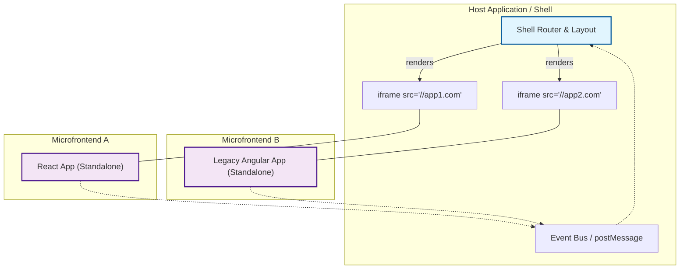

# Интеграция через iframe (Iframe Integration)

Представьте, что вам нужно встроить огромного, древнего монстра на AngularJS в ваш новенький, сияющий React-портал. Или, наоборот, безопасно отобразить сторонний виджет оплаты, код которого вы не контролируете. В такие моменты на сцену выходит самый старый, самый надежный и одновременно самый ненавидимый инструмент веб-интеграции — `<iframe>`.

## Что это и какую боль решаем?

**Iframe Integration** — это подход к построению микрофронтендов, при котором каждое независимое приложение (или его часть) загружается в собственном теге `<iframe>`. 

Главная боль, которую решает iframe — **отсутствие изоляции**. В браузере глобальная область видимости (Window), DOM и CSS по умолчанию общие. Если два микрофронтенда случайно используют один и тот же класс `.btn` или глобальную переменную `window.store`, все сломается. Iframe предоставляет **абсолютную песочницу** (sandbox) на уровне браузера: свои глобальные переменные, свой DOM, свой CSS. Никто ни на кого не повлияет.

## Как это работает?

Host-приложение (Shell) отвечает за общий каркас, роутинг верхнего уровня и отображение iframe'ов. Микрофронтенды живут по своим URL-адресам и даже не подозревают, что они встроены куда-то еще. Общение между ними происходит через асинхронный браузерный API `window.postMessage`.



## Примеры кода: Общение между мирами

### Антипаттерн: Прямой доступ к DOM
Попытка достучаться из iframe к родительскому окну (или наоборот) через DOM — прямой путь к боли с CORS и хрупкости.
```javascript
// ❌ ТАК ДЕЛАТЬ НЕЛЬЗЯ: Упадет с ошибкой CORS на разных доменах
const parentDiv = window.parent.document.getElementById('header');
```

### Как надо: Контрактное взаимодействие через postMessage

**Внутри микрофронтенда (Iframe):**
```javascript
// Отправляем событие наружу
function addToCart(item) {
  window.parent.postMessage(
    { type: 'MFE_CART_ADD', payload: item }, 
    'https://host-app.com' // Всегда указывайте targetOrigin для безопасности!
  );
}
```

**Внутри Host-приложения:**
```javascript
// Слушаем события от микрофронтендов
window.addEventListener('message', (event) => {
  // 1. Проверяем источник (security first)
  if (event.origin !== 'https://trusted-mfe.com') return;

  // 2. Обрабатываем контракт
  if (event.data.type === 'MFE_CART_ADD') {
    updateGlobalCart(event.data.payload);
  }
});
```

## Скрытые трейдоффы и границы применимости

Несмотря на идеальную изоляцию, iframe часто называют "легаси-костылем". Вот почему за абсолютную изоляцию приходится платить высокую цену:

1. **UX-катастрофы (The Boundary Problem):** Всплывающие окна (модалки, тултипы, селекты) внутри iframe обрезаются его границами. Они не могут перекрыть host-приложение. Прокрутка внутри iframe и прокрутка самой страницы часто конфликтуют, создавая ужасный опыт (например, двойные скроллбары).
2. **Производительность:** Каждый iframe — это полноценный инстанс браузера. Загружаете 3 микрофронтенда на React? Вы скачаете, распарсите и выполните React три раза. Разделение ресурсов (vendor chunks) между iframe'ами практически невозможно.
3. **Роутинг и SEO:** URL в строке браузера принадлежит host-приложению. Если вы переходите по страницам внутри iframe, URL в адресной строке не меняется (пользователь не может поделиться ссылкой или обновить страницу без потери состояния). Синхронизация роутинга через `postMessage` превращается в сложный стейт-менеджмент.
4. **Доступность (A11y):** Скринридерам сложнее правильно интерпретировать контекст страницы, разбитой на iframe'ы.

### Когда использовать?

✅ **Интеграция Legacy:** Когда нужно встроить старое приложение, которое "грязнит" глобальный скоуп и которое вы не можете/не хотите рефакторить.
✅ **Сторонние виджеты:** Интеграция 3rd-party решений (платежные шлюзы, чаты поддержки), где безопасность и изоляция критичны.
✅ **Изоляция безопасности:** Если микрофронтенд исполняет недоверенный код, песочница iframe — лучший выбор.

### Когда избегать?

❌ Для построения монолитного UI из множества мелких, тесно связанных компонентов.
❌ Когда критически важна производительность первого кадра и переиспользование общих зависимостей.
❌ Если микрофронтенды должны сложно взаимодействовать (например, drag-and-drop элементов из одного MFE в другой).

Iframe — это отличный инструмент, когда вам нужны две **совершенно независимые** комнаты, но это ужасный выбор, если вам нужно убрать стену между ними.
