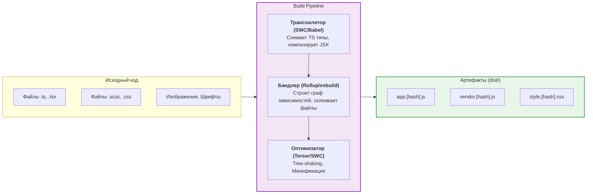

Архитектура сборки (Build Architecture) — это фундамент процесса трансформации исходного кода (TypeScript, SCSS, React JSX) в оптимизированный набор статических файлов (HTML, CSS, JS), готовых для исполнения в браузере или на сервере.

В современных фронтенд-проектах сборка перестала быть просто конкатенацией файлов. Это сложный конвейер (pipeline) инструментов, каждый из которых решает узкую задачу оптимизации производительности и Developer Experience (DX).

## 1. Суть концепции: Из чего состоит современная сборка

Исторически сборку выполнял один монолитный инструмент (например, Webpack). Сегодня архитектура сборки строится по модульному принципу, разделяя задачи на этапы:

1. **Транспиляция (Transpilation):** Преобразование современного синтаксиса (TS, JSX, ESNext) в стандартный JavaScript, понятный целевым браузерам (инструменты: SWC, Babel, tsc).
2. **Бандлинг (Bundling):** Сборка тысяч мелких модулей в несколько оптимизированных файлов-чанок (инструменты: Rollup, esbuild, Webpack).
3. **Оптимизация и минификация:** Удаление неиспользуемого кода (Tree Shaking), сжатие (Minification) имен переменных, разделение кода по маршрутам (Code Splitting).

## 2. Разделение Development и Production сборки

Главная боль разработчика — время ожидания обновления страницы после изменения кода (HMR — Hot Module Replacement). Поэтому современная архитектура сборки радикально отличается для локальной разработки и для продакшена (яркий пример — Vite).

### Development Mode (Локальная разработка)
* **Цель:** Максимальная скорость запуска и мгновенная реакция на изменения.
* **Как работает:** Бандлинг (склейка файлов) **отключается**. Исходный код подается в браузер напрямую через нативные ES-модули (`<script type="module">`). Транспилятор (esbuild/swc) лишь на лету переводит TS/JSX в JS для каждого отдельно запрошенного файла.
* **Результат:** Запуск сервера за 100мс, HMR за 10мс, независимо от размера проекта.

### Production Mode (Релиз)
* **Цель:** Минимальный размер бандла и максимальная скорость загрузки у пользователя.
* **Как работает:** Включается тяжелый бандлер (Rollup). Он анализирует весь проект, вырезает мертвый код (Tree Shaking), разбивает файлы на чанки (чтобы кэшировать vendor-библиотеки типа React отдельно) и жестко минифицирует код.
* **Результат:** Сборка может занимать минуты, но на выходе получается идеально оптимизированная статика.

## 3. Неочевидные нюансы и Трейдоффы

### 3.1. Полифиллы и Target Browsers
Размер бандла напрямую зависит от того, какие браузеры вы поддерживаете. Если в конфиге сборки (например, `.browserslistrc`) указана поддержка старых браузеров, транспилятор будет внедрять тяжеловесные полифиллы (код, эмулирующий новые функции в старых браузерах) и преобразовывать лаконичный синтаксис (например, async/await или классы) в громоздкие функции-генераторы.
* **Трейдофф:** Поддержка старых браузеров = Большой размер бандла = Медленная загрузка для современных пользователей.
* **Решение:** Modern build (использование `type="module"` для современных браузеров и `nomodule` fallback для старых).

### 3.2. Хэширование имен файлов (Cache Invalidation)
Сборщик всегда добавляет хэш к имени выходного файла (например, `main.a3b8c9.js`). 
* **Зачем?** Чтобы браузер пользователя закэшировал файл "навсегда" (`Cache-Control: immutable`). Когда разработчик меняет код, хэш меняется, и браузер скачивает только новый файл.
* **Скрытая проблема (Vendor Splitting):** Если весь код (и ваши компоненты, и тяжелый `react-dom`) собран в один файл `main.js`, то при изменении одной кнопки у пользователя перекачается весь мегабайтный файл. 
* **Как надо:** Настраивать бандлер так, чтобы код из `node_modules` выносился в отдельный чанк `vendor.[hash].js`. Он будет обновляться крайне редко.

### 3.3. Разделение типов и кода
Транспиляторы на Rust (SWC, esbuild) компилируют код в 100 раз быстрее TSC (TypeScript Compiler), но они **не проверяют типы** (Type Checking). Они просто "стирают" TS-синтаксис.
* **Следствие:** Сборка может пройти успешно, даже если в коде есть грубые ошибки типизации.
* **Как решается:** Архитектура сборки разделяется на два параллельных процесса. Сборщик (Vite) мгновенно собирает проект, а `tsc --noEmit` запускается в фоновом режиме (или в CI) только для проверки типов.
