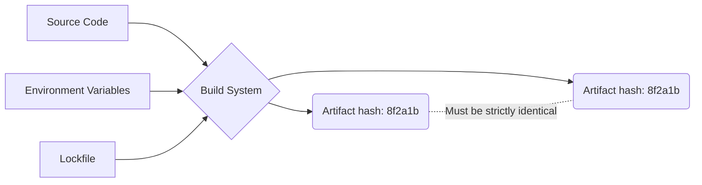

# Build Reproducibility (Воспроизводимость сборки)

**Воспроизводимость сборки (Build Reproducibility)** — это гарантия того, что компиляция одного и того же исходного кода в идентичном окружении всегда приведет к побитово совпадающему артефакту сборки (бинарнику или бандлу). 

## Боль, которую мы решаем

Представьте ситуацию: разработчик Вася собирает проект локально — всё работает. Он пушит код, CI собирает проект для продакшена — всё падает. Или еще хуже: мы пересобираем старый коммит полугодовой давности, и он выдает другой хэш файла, ломая кеши браузера или падая с непонятными багами. 
Причины: "плавающие" версии зависимостей (`^1.2.3`), разное время сборки, вшитое в бандл, разные абсолютные пути на машине Васи и на CI-сервере, разные версии Node.js или ОС.

## Как это работает

Чтобы достичь воспроизводимости, система сборки должна быть строго детерминированной:
1. **Зафиксированные зависимости:** Использование `package-lock.json` или `pnpm-lock.yaml`.
2. **Изолированное окружение:** Сборка в Docker-контейнерах с фиксированной версией Node.js и ОС.
3. **Отсутствие side-effects:** Не использовать `Date.now()` или `Math.random()` при генерации ID во время сборки. 
4. **Относительные пути:** Использовать относительные пути вместо абсолютных (макросы типа `__dirname` могут подставить разные пути на разных машинах).



## Пример: Антипаттерн vs Решение

**Антипаттерн:** Внедрение текущего времени как версии сборки.
```javascript
// webpack.config.js
module.exports = {
  plugins: [
    new webpack.DefinePlugin({
      'process.env.BUILD_TIME': JSON.stringify(new Date().toISOString()) // ❌ Ломает воспроизводимость!
    })
  ]
}
```

**Правильное решение:** Использовать хэш коммита (он детерминирован для одного и того же кода).
```javascript
// webpack.config.js
const commitHash = require('child_process').execSync('git rev-parse --short HEAD').toString().trim();

module.exports = {
  plugins: [
    new webpack.DefinePlugin({
      'process.env.BUILD_VERSION': JSON.stringify(commitHash) // ✅ Хэш всегда одинаковый для этого кода
    })
  ]
}
```

## Неочевидные нюансы и трейдоффы

1. **Remote Caching:** В монорепозиториях (Turborepo, Nx) воспроизводимость критически важна. Если сборка не детерминирована, вы не сможете безопасно переиспользовать результаты сборки из удаленного кеша — другой разработчик скачает кеш, который сломает ему локальную среду.
2. **Сложность настройки:** Достичь 100% побитовой воспроизводимости сложно. Некоторые плагины (например, минификаторы или генераторы source maps) могут вносить случайный порядок ключей в словарях.
3. **Оверхед:** Жесткая фиксация окружения требует поддержки Docker-образов и строгого контроля за обновлениями инфраструктуры.
