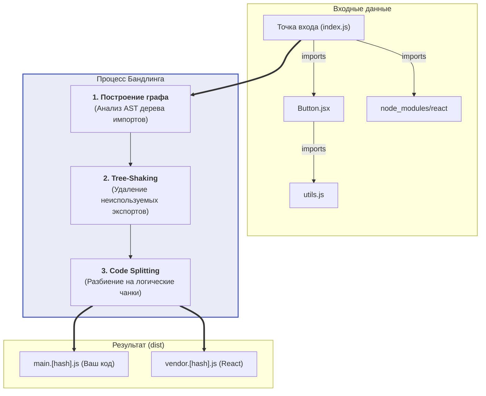

Бандлинг (Bundling) — это процесс объединения множества разрозненных модулей (JavaScript-файлов, CSS, изображений) в один или несколько оптимизированных файлов (бандлов/чанков), которые загружаются в браузер.

Хотя современные браузеры поддерживают нативные ES-модули (ESM), бандлинг остается критически важным этапом для Production-среды.

## 1. Какую боль мы решаем?

Представьте, что ваше приложение состоит из 500 маленьких React-компонентов, а также использует `lodash` (где еще 300 файлов) и `date-fns`.

**Что будет, если не использовать бандлер (отдавать как есть):**
Когда пользователь заходит на страницу, браузер читает импорты и начинает загружать файлы. Чтобы загрузить 800 файлов по сети (даже с HTTP/2), браузеру придется сделать 800 сетевых запросов. На мобильном интернете с высоким пингом (Latency) это приведет к "эффекту водопада" (Waterfall) — загрузка страницы займет десятки секунд.

**Что делает бандлер:**
Он проходит по дереву импортов (AST), собирает все 800 файлов в памяти, склеивает их и выдает один файл `app.js`. Браузер скачивает приложение одним быстрым запросом.

## 2. Как работает бандлер под капотом



### Основные механизмы:

1. **Resolution (Поиск модулей):** Когда бандлер видит `import { useState } from 'react'`, он использует механизм Node Resolution, чтобы найти реальный файл React в папке `node_modules`.
2. **Tree Shaking (Встряхивание дерева):** Бандлер анализирует, какие функции реально используются. Если вы импортировали `import { isEmpty } from 'lodash'`, бандлер вырежет все остальные 300 функций lodash, оставив только `isEmpty`.
3. **Code Splitting (Разделение кода):** Склеивать всё в один гигантский файл (5 МБ) — тоже плохо (браузер будет долго его парсить). Бандлер умеет разделять код на куски (chunks). Например, выносить библиотеки в отдельный чанк `vendor.js`, или лениво загружать код страниц по мере перехода (Dynamic Imports: `import('./SettingsPage')`).

## 3. Практические примеры и Антипаттерны

### Антипаттерн: Потеря Tree-Shaking из-за CommonJS
Tree-shaking корректно работает **только со статическими ES-модулями** (`import / export`).
Если вы импортируете старую библиотеку, написанную на CommonJS (`require / module.exports`), бандлер не может статически проанализировать, что именно из нее используется, и включит библиотеку в бандл **целиком**.

```javascript
// ❌ АНТИПАТТЕРН: Импорт всей библиотеки (CommonJS или плохой ESM)
import _ from 'lodash'; 
const result = _.isEmpty(data);
// В бандл попадет весь lodash (~70kb)

// ✅ ПРАВИЛЬНО: Точечный импорт (или использование lodash-es)
import { isEmpty } from 'lodash-es';
// В бандл попадет только функция isEmpty (~1kb)
```

### Пример Code Splitting (Ленивая загрузка)
В React мы можем сказать бандлеру: "Не включай этот тяжелый компонент (например, графики Chart.js) в главный бандл, скачай его только тогда, когда пользователь откроет эту страницу".

```jsx
import React, { Suspense, lazy } from 'react';

// Бандлер (Vite/Webpack) увидит этот синтаксис и создаст отдельный JS-файл для ChartComponent
const HeavyChart = lazy(() => import('./components/HeavyChart'));

function Dashboard() {
  return (
    <div>
      <h1>Статистика</h1>
      <Suspense fallback={<div>Загрузка графика...</div>}>
        <HeavyChart data={...} />
      </Suspense>
    </div>
  );
}
```

## 4. Границы применимости: Всегда ли нужен Бандлинг?

С появлением HTTP/3 и широкой поддержкой ESM в браузерах возникает вопрос: не отказаться ли от бандлинга?

* **Development-среда:** Бандлинг больше **НЕ нужен**. Инструменты вроде Vite отдают файлы напрямую в браузер как ESM, что делает старт проекта мгновенным.
* **Production-среда:** Бандлинг **всё еще необходим**. Даже с HTTP/3, где нет блокировки соединений, скачивание 1000 мелких файлов несет огромный оверхед на парсинг каждого файла и установку сетевых заголовков. Плюс, без бандлинга невозможно сделать эффективный Tree-Shaking и минификацию.
