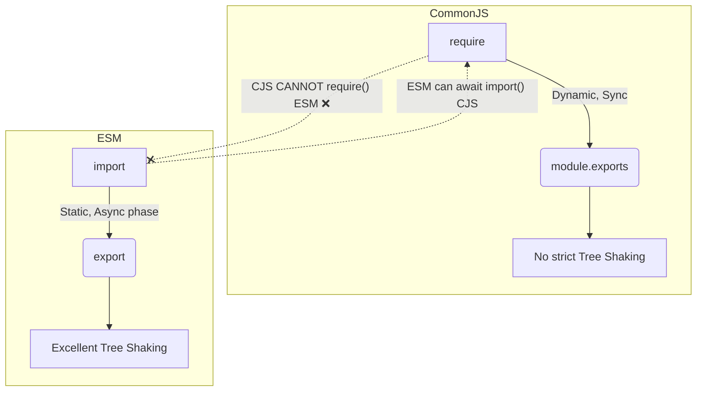

# ESM и CommonJS (Форматы модулей)

В экосистеме JavaScript исторически сложился раскол форматов модулей: **CommonJS (CJS)**, созданный для Node.js, и **ECMAScript Modules (ESM)**, стандартизированный для браузеров и современного JS.

## Боль, которую мы решаем

JavaScript долго не имел встроенной модульной системы. Node.js придумал `require()` и `module.exports` (CJS). Позже комитет TC39 стандартизировал `import` и `export` (ESM). Переходный период затянулся: браузеры понимают ESM, старые Node-проекты работают на CJS, а разработчики хотят использовать одни и те же npm-пакеты везде. Попытка скрестить их часто приводит к ошибкам вроде `ERR_REQUIRE_ESM` или `Cannot use import statement outside a module`.

## Как это работает на практике

**CommonJS (CJS):** Динамический, синхронный. Модуль — это просто объект, собираемый во время выполнения.
**ESM:** Статический, асинхронный (потенциально). Зависимости анализируются на этапе парсинга, еще до выполнения кода, что позволяет делать эффективный Tree-Shaking.



## Пример проблемы: "Dual Package Hazard"

Если библиотека публикуется сразу в двух форматах, есть риск, что в бандл попадут *обе* версии.
```javascript
// Пакет utils публикует и ESM, и CJS
import { foo } from 'utils'; // ESM
const { bar } = require('utils'); // CJS

// Опасно: если 'utils' хранит внутреннее состояние (state), 
// то теперь в памяти ДВА разных инстанса state!
```

**Правильное решение (в `package.json` библиотеки):**
Использовать поле `exports` для строгого маппинга.
```json
{
  "name": "my-lib",
  "type": "module",
  "exports": {
    "import": "./dist/index.mjs",
    "require": "./dist/index.cjs"
  }
}
```

## Неочевидные нюансы и трейдоффы

1. **Правило импортов:** ESM-модуль может импортировать CJS-модуль. Но CJS-модуль **не может** через `require()` синхронно импортировать ESM-модуль (только через асинхронный динамический `import()`).
2. **Макросы Node.js:** В ESM больше нет глобальных переменных `__dirname`, `__filename`, `require` и `module`. Их нужно конструировать вручную через `import.meta.url`.
3. **Строгость расширений:** В нативном ESM в Node.js (или в браузере) вы обязаны указывать расширение файла при импорте (`import './utils.js'`), тогда как бандлеры (Webpack, Vite) и CJS раньше прощали отсутствие расширения, додумывая его за вас.
