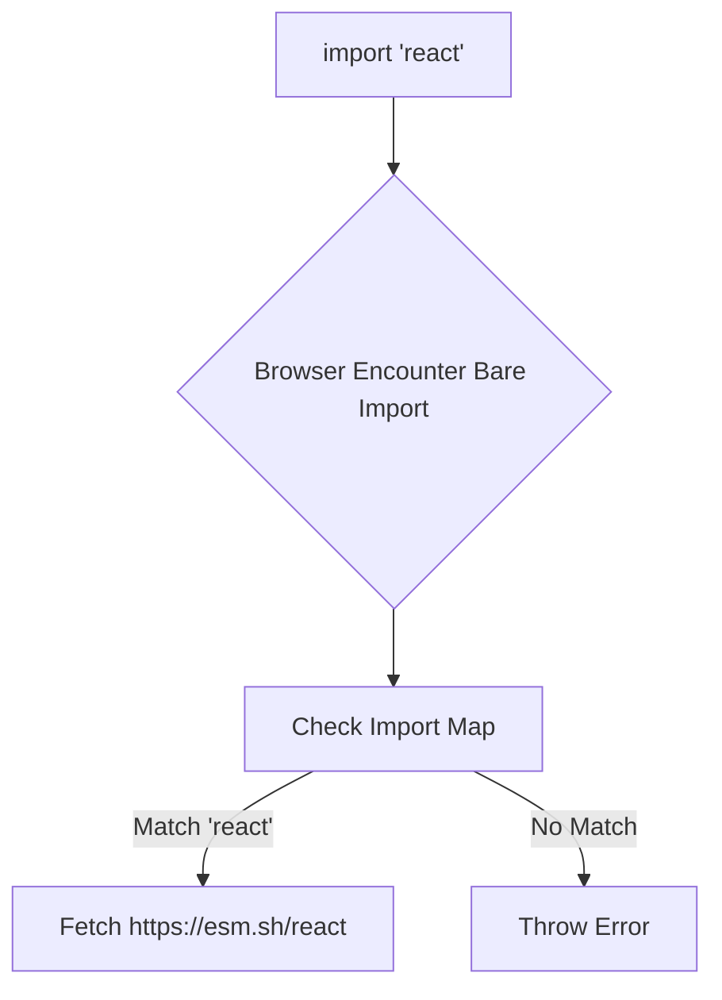

# Import Maps

Долгое время нативный ES Modules в браузере был практически бесполезен для серьезной разработки из-за одной критической проблемы: браузеры не понимали так называемые "bare imports" (голые импорты).

## Боль, которую мы решаем

Если написать в коде `import React from "react"`, браузер упадет с ошибкой. Он понимает только абсолютные URL или относительные пути (`./react.js`), но не знает, где на сервере или в интернете искать пакет `react`. Исторически эту задачу (Module Resolution) брали на себя бандлеры (Webpack), заменяя "react" на реальный путь или встраивая код в бандл. Но что, если мы хотим работать вообще без бандлера, отдавая в браузер нативные ESM-модули?

## Как это работает на практике

**Import Maps (Карты импортов)** — это стандартный тег `<script type="importmap">`, который выступает "роутером" для модулей прямо в браузере. Он объясняет движку V8, откуда именно нужно загружать библиотеку при встрече голого импорта.

```html
<!-- Правильное решение: Настройка Import Map в index.html -->
<script type="importmap">
{
  "imports": {
    "react": "https://esm.sh/react@18.2.0",
    "react-dom": "https://esm.sh/react-dom@18.2.0",
    "lodash/": "https://esm.sh/lodash-es/"
  }
}
</script>

<script type="module">
  // Теперь это работает нативно в браузере, без Webpack!
  import React from 'react';
  import { debounce } from 'lodash/debounce.js';
</script>
```



## Неочевидные нюансы и трейдоффы

1. **Микрофронтенды:** Import Maps — это идеальный фундамент для нативных микрофронтендов (например, Single-SPA). Можно динамически менять мапы, указывая разным версиям приложения разные URL модулей, обновляя микрофронтенды без пересборки хоста.
2. **Один на страницу:** На странице может быть только один `<script type="importmap">`. Если вы используете несколько микрофронтендов, вам придется агрегировать их импорты в один общий маппинг. (Для обхода этого используют полифиллы вроде `es-module-shims`).
3. **Waterfall загрузок:** Использование Import Maps без бандлера для большого приложения приведет к "сетевому водопаду" (waterfall): браузер скачает первый файл, найдет в нем 10 импортов, скачает их, в них найдет еще 100... Это убивает производительность, поэтому для продакшена классическая бандлинг-сборка все еще предпочтительнее.
