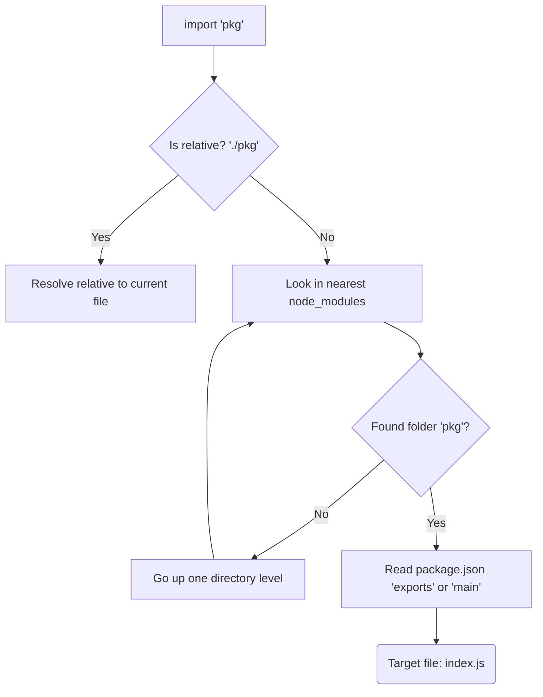

# Module Resolution (Разрешение модулей)

**Module Resolution (Алгоритм разрешения модулей)** — это свод правил, по которым среда выполнения (Node.js) или бандлер (Webpack, Vite) определяет, какой именно файл на диске скрывается за строкой `import { Button } from '@ui/button'`.

## Боль, которую мы решаем

Разработчики не пишут в коде полные абсолютные пути (`/home/user/project/node_modules/react/index.js`). Они пишут удобные короткие имена (`react`) или пути с алиасами (`@components/Header`). Задача алгоритма — пройти квест по файловой системе, найти нужный файл, не перепутать версии и корректно обработать расширения (`.js`, `.ts`, `.tsx`, `.d.ts`). Если алгоритм ошибается, мы получаем `Module not found` или загружаем не тот код.

## Как это работает на практике

Алгоритм (чаще всего Node.js Resolution Algorithm) работает рекурсивно.
Если вы пишете `import 'lodash'`, он ищет:
1. `./node_modules/lodash`
2. `../node_modules/lodash`
3. `../../node_modules/lodash` и так до корня диска.

Найдя папку, он читает `package.json` внутри нее и смотрит на поля `main`, `module` или (в современных версиях) `exports`. 



## Пример конфигурации (Path Aliases)

Чтобы избежать "ада относительных путей" (`../../../../components`), разработчики настраивают **алиасы**. Это переопределение алгоритма Module Resolution.

```json
// tsconfig.json (настройка для TypeScript)
{
  "compilerOptions": {
    "baseUrl": ".",
    "paths": {
      "@components/*": ["src/components/*"],
      "@utils/*": ["src/shared/utils/*"]
    }
  }
}
```
*Важно:* TypeScript только *понимает* алиасы при проверке типов. Чтобы код заработал, бандлер (Webpack/Vite) или ран-тайм (Node.js) тоже должен быть настроен на эти алиасы.

## Неочевидные нюансы и трейдоффы

1. **Node16 Resolution:** С приходом ESM алгоритм стал строже. Раньше можно было написать `import './utils'`, и Node.js сам подбирал расширение (`.js`, `.json`, или `index.js`). Теперь в ESM нужно писать точный путь с расширением: `import './utils.js'`.
2. **Package Exports:** Поле `"exports"` в `package.json` создало жесткие границы (Package Boundaries). Если библиотека не экспортировала файл явно, вы не сможете импортировать его "глубоким" импортом вроде `import { X } from 'lib/internal/secret.js'`, даже если файл физически есть на диске.
3. **Симлинки (Symlinks):** В монорепозиториях пакеты связаны символическими ссылками. Алгоритм Module Resolution (особенно в Webpack) может "заблудиться" или неправильно разрешить дубликаты зависимостей через симлинки (в Webpack для этого есть настройка `resolve.symlinks: false`).
