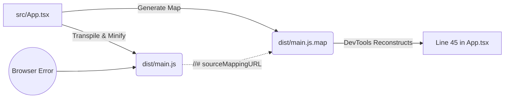

# Source Maps (Карты исходников)

**Source Maps** — это специальные JSON-файлы, которые связывают минифицированный, транспилированный и запутанный код из продакшен-бандла обратно с вашим красивым и понятным исходным кодом (TypeScript/JSX), чтобы вы могли отлаживать его в DevTools.

## Боль, которую мы решаем

Когда бандлер (Webpack, Vite) готовит код к продакшену, он сливает сотни файлов в один, удаляет пробелы, переименовывает переменные `userAccountBalance` в `a` или `x`, вырезает комментарии и превращает современный синтаксис (или TS) в старый JS. 
Если в продакшене падает ошибка на строке 1 колонке 84592 файла `main.min.js`, понять, где именно в вашем исходном `App.tsx` это произошло, абсолютно невозможно. Без Source Maps дебаг превращается в слепую угадайку.

## Как это работает на практике

Source Map — это словарь со сложной кодировкой (Base64 VLQ), который говорит: "символ `a` на 10-й строке бандла — это функция `calculateTotal` на 45-й строке файла `cart.ts`". 

В конце минифицированного JS файла бандлер оставляет специальный комментарий:
`//# sourceMappingURL=main.min.js.map`
Браузер (когда вы открываете DevTools) видит этот комментарий, скачивает `main.min.js.map` и восстанавливает оригинальную файловую структуру в панели Sources.

## Антипаттерн и Правильное решение

**Антипаттерн:** Выкладывать Source Maps в открытый доступ на продакшене для B2B/Enterprise приложений.
Если хакер зайдет в DevTools, он увидит ваш исходный код в первозданном виде со всеми комментариями и архитектурой.

**Правильное решение:** 
Загружать Source Maps в систему мониторинга ошибок (Sentry, Datadog) на этапе CI/CD пайплайна, а с публичного сервера их удалять.
Таким образом, Sentry покажет вам стек-трейс с реальными строками кода, но обычные пользователи в браузере карты не получат.

## Неочевидные нюансы и трейдоффы

1. **Типы Source Maps:** В Webpack есть десятки типов карт (`eval`, `cheap-module-source-map`, `source-map`). Самые точные карты генерируются медленно, поэтому для Development используют быстрые неточные мапы (например, `eval`), а для Production — полноценные, но с долгим билдом.
2. **Размер:** Файл `.map` может быть в 3-5 раз больше самого JS-бандла! Их ни в коем случае нельзя грузить синхронно с приложением (браузеры по умолчанию их и не скачивают, пока не открыть консоль).
3. **Утерянные токены:** Иногда минификаторы (Terser) вырезают код так агрессивно, что ломают маппинг. Вы можете поставить breakpoint в DevTools, а выполнение остановится на две строки ниже, потому что точное соответствие было утеряно.
