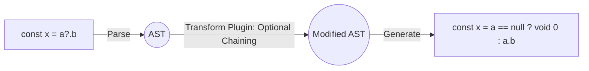

# Transpilation (Транспиляция)

**Транспиляция (Transpilation)** — это процесс преобразования исходного кода, написанного на одном языке или диалекте, в код на другом языке **того же уровня абстракции** (в отличие от компиляции, где код переводится в низкоуровневый машинный код). Во фронтенде это чаще всего означает перевод TypeScript, JSX или современного ECMAScript (ES2023) в старый JavaScript (ES5/ES6), понятный старым браузерам.

## Боль, которую мы решаем

Спецификация JavaScript обновляется каждый год (Optional Chaining, Nullish Coalescing, декораторы). Браузеры внедряют новые фичи медленно и неравномерно (Safari может отставать на годы). Если написать код с использованием самых современных фич, он просто упадет с `SyntaxError` у части пользователей.
Кроме того, браузеры в принципе не понимают TypeScript (типы) и JSX (HTML-разметку внутри JS). Нам нужен инструмент, который "вырежет" типы и превратит тэги в вызовы `React.createElement`.

## Как это работает на практике

Транспилятор (Babel, SWC, tsc) читает код, строит из него абстрактное синтаксическое дерево (AST), трансформирует его согласно настроенным плагинам (например, "переписать стрелочные функции в обычные") и генерирует новую текстовую строку.



## Пример конфигурации (Babel vs SWC)

Исторически стандартом был Babel. Он невероятно гибкий, но написан на JavaScript и работает медленно.
Современный тренд — переписывать транспиляторы на системных языках (Rust, Go).

**Антипаттерн:** Использовать голый `tsc` (TypeScript Compiler) для транспиляции в монорепозитории. Он медленный и может только удалять типы, но не умеет применять сложные полифиллы для старых браузеров.

**Правильное решение:** Использовать Rust-транспилятор (SWC) через бандлер.
```javascript
// Пример: SWC в миллисекунды превратит JSX и TS в чистый JS
const swc = require('@swc/core');

swc.transformSync("const App = () => <div />", {
  jsc: {
    parser: { syntax: "ecmascript", jsx: true },
    transform: { react: { runtime: "automatic" } }
  }
});
```

## Неочевидные нюансы и трейдоффы

1. **Транспиляция vs Полифиллы (Polyfills):** Транспиляция меняет *синтаксис* (стрелочные функции в `function()`). Но она не добавит недостающие методы вроде `Array.prototype.includes`. Для этого нужны полифиллы (core-js), которые "дописывают" недостающие функции в глобальное окружение браузера.
2. **Bundle Size Overhead:** Превращение элегантного `async/await` в код для старого ES5 (с генераторами и регенератором) может увеличить размер бандла в 2-3 раза. Транспилировать код под IE11 сегодня — это наносить ущерб 99% пользователей ради 1%.
3. **Vite подход:** Современные тулзы (Vite, esbuild) вообще отказались от глубокой транспиляции в Dev-режиме. Они отдают в браузер современный JS (модули, стрелочные функции) почти без изменений, чтобы ускорить перезагрузку страницы (HMR) в 10-100 раз. Глубокая транспиляция под старые браузеры применяется только при финальной сборке в продакшен.
