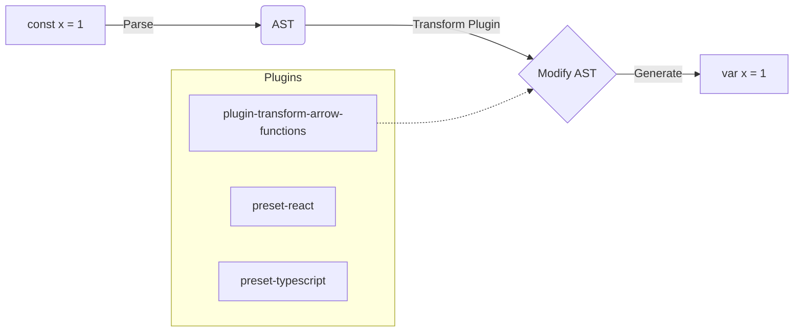

# Babel

**Babel** — это самый известный и исторически важный транспилятор в экосистеме JavaScript. В эпоху, когда стандарты ES6 (2015) только появились, а браузеры их не поддерживали, Babel стал тем самым мостом, который позволил разработчикам писать современный код (стрелочные функции, классы, деструктуризацию), преобразуя его в старый и совместимый со всем подряд ES5.

## Боль, которую мы решаем

Синтаксис JavaScript развивается быстрее, чем обновляются браузеры (особенно в Enterprise-сегменте, где годами сидели на IE11). Кроме того, браузеры не понимают JSX (React) и TypeScript. Нам нужен инструмент, который прочитает этот нестандартный или слишком новый код и аккуратно перепишет его на "безопасный" классический JS.

## Как это работает на практике

Архитектура Babel гениально проста и модульна:
1. **Парсер (Babylon):** Читает исходный код и строит Abstract Syntax Tree (AST).
2. **Трансформатор:** Прогоняет AST через сотни маленьких плагинов (каждый плагин делает только одну вещь: например, меняет `const` на `var`).
3. **Генератор:** Собирает измененное AST обратно в строку JavaScript-кода.

**Антипаттерн (в современных реалиях):**
Использовать Babel для сборки нового крупного проекта. Он написан на JavaScript, парсинг AST и генерация строк очень дороги по CPU и памяти. На больших проектах сборка с Babel может занимать минуты.

**Правильное решение:**
Использовать транспиляторы на системных языках: SWC (Rust) или esbuild (Go). Они делают ту же самую работу, но в 20–70 раз быстрее.

## Неочевидные нюансы и трейдоффы

1. **Макросы (Babel Macros):** Главная причина, почему Babel до сих пор жив — это его плагинная система. Инструменты вроде `styled-components` или `Relay` используют Babel для трансформации кода на этапе сборки (например, хэширование имен CSS-классов). SWC и esbuild пока не имеют такой же богатой экосистемы плагинов.
2. **Presets vs Plugins:** Чтобы не подключать 50 плагинов по одному, в Babel придумали пресеты (`@babel/preset-env`). Пресет-env сам смотрит в ваш `.browserslistrc` и включает только те трансформеры, которые нужны для поддержки указанных вами версий браузеров.
3. **Polyfills:** Babel занимается только *синтаксисом*. Он не добавит в браузер `Promise` или `Array.includes`. Для этого Babel работает в паре с `core-js` (полифиллами).
