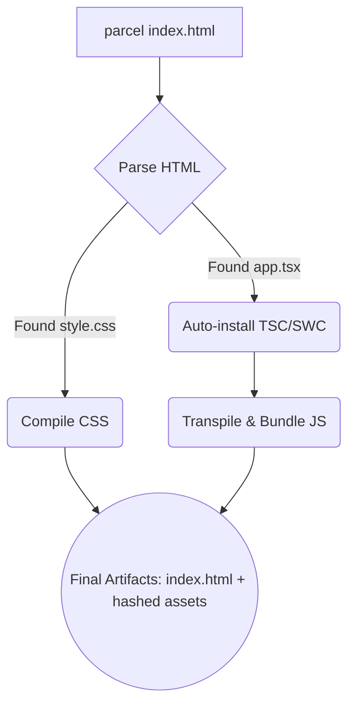

# Parcel

**Parcel** — это бандлер для веб-приложений, который сделал ставку на радикальную идею: **Zero Configuration** (нулевая конфигурация). В то время как Webpack требовал написания сотен строк `webpack.config.js` для простейшего React-приложения, Parcel предлагал просто указать HTML-файл как точку входа и нажать Enter.

## Боль, которую мы решаем

Настройка бандлера часто превращается в отдельную профессию. Чтобы собрать проект с React, TypeScript, SCSS и картинками, нужно установить десяток лоадеров, настроить регулярные выражения для путей, плагины для минификации и Dev-сервер. Для небольших проектов, лендингов или прототипов этот оверхед совершенно неоправдан. Разработчик хочет просто писать код, а не воевать с конфигами.

## Как это работает на практике

Parcel берет на себя роль "умного угадывателя". Вы скармливаете ему `index.html`. Он парсит его, находит тег `<script src="./app.tsx">`. Видит расширение `.tsx` — ага, это TypeScript и React! Он **сам** скачивает нужные транспиляторы, собирает JS, находит внутри JS импорт `.scss` файла, сам компилирует SASS и подставляет хэшированные имена файлов обратно в HTML.

## Трейдоффы и границы применимости

**Плюсы (Где применимо):**
- Идеально для хакатонов, пет-проектов и быстрых MVP.
- Отличная многопоточность: Parcel использует все ядра процессора и мощно кеширует результаты на диск, поэтому последующие сборки происходят почти мгновенно (в Parcel 2 под капотом используется SWC на Rust).
- Из коробки поддерживает HMR (Hot Module Replacement), разделение кода (Code Splitting) и сжатие картинок.

**Минусы (Где ломается):**
- **Недостаток гибкости:** "Магия" работает ровно до тех пор, пока вы находитесь в рамках стандартных подходов. Если вам нужно хитрое переопределение путей (module resolution), нестандартный механизм инъекции переменных окружения или специфичный алиасинг для микрофронтендов — Parcel становится вашей главной проблемой. Отключить или переопределить встроенное поведение часто сложнее, чем написать конфиг Webpack с нуля.
- Монорепозитории: Интеграция Parcel в сложные Enterprise монорепы (Nx, Turborepo) с шарингом библиотек традиционно вызывает много боли из-за его жестких предположений о структуре проекта.
