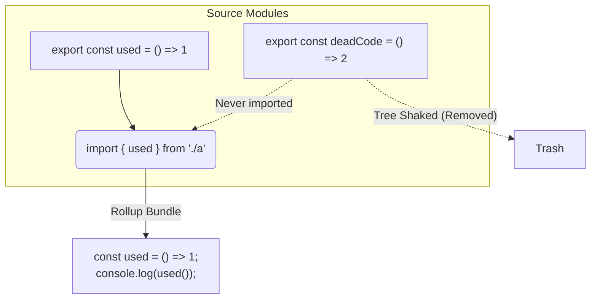

# Rollup

**Rollup** — это модульный бандлер для JavaScript, который изначально создавался с одной четкой целью: максимально эффективно собирать переиспользуемые библиотеки (packages), а не конечные приложения (apps). Именно Rollup популяризировал концепцию "Tree Shaking" во фронтенде.

## Боль, которую мы решаем

Исторически Webpack "оборачивал" каждый модуль в специальную функцию-замыкание, чтобы имитировать систему модулей в браузере. Это создавало огромный оверхед: бандл получался раздутым от служебного кода Webpack. Для приложений это было терпимо, но если вы пишете библиотеку (например, `lodash` или `React`), вы хотите, чтобы на выходе получался максимально чистый, плоский код без лишних оберток. Кроме того, если пользователь импортирует из вашей библиотеки только одну функцию, всё остальное должно быть безжалостно "отрезано".

## Как это работает на практике

Rollup опирается исключительно на статический анализ стандарта **ES Modules** (`import` / `export`). 

**Scope Hoisting (Поднятие областей видимости):** В отличие от старого Webpack, Rollup берет все ваши разрозненные модули и помещает их в **одну** гигантскую функцию (область видимости), переименовывая переменные во избежание конфликтов. На выходе получается "плоский" файл, который браузер парсит намного быстрее.
**Tree Shaking (Встряхивание дерева):** Так как связи статические, Rollup видит, какие экспорты никогда не импортируются, и просто не включает их в финальный бандл.

## Правильное применение vs Антипаттерн

**Правильное решение:** Использовать Rollup для сборки NPM-пакетов (UI-китов, утилит).
Он умеет генерировать бандлы в разных форматах: ESM (для современных бандлеров), CJS (для старого Node.js) и UMD (для старых браузеров через тег `<script>`).

**Антипаттерн:** Использовать голый Rollup для сборки сложных Single Page Applications (SPA).
Хотя это возможно, экосистема плагинов Rollup для обработки CSS, картинок, HMR (Hot Module Replacement) и Code Splitting долгое время уступала Webpack. (Но эту проблему решил Vite, который использует Rollup под капотом для продакшен-сборок!).

## Неочевидные нюансы и трейдоффы

1. **Проблема с CommonJS:** Так как Rollup ожидает строгий ESM, импорт старых CommonJS-пакетов из `node_modules` (где используется `require`) вызывает у него ступор. Для этого приходится использовать плагин `@rollup/plugin-commonjs`, который пытается "на лету" конвертировать CJS в ESM, что часто приводит к неочевидным багам.
2. **Vite = Dev Server + Rollup:** Популярность Rollup взлетела до небес благодаря Vite. Vite использует esbuild для мгновенного Dev-сервера, но для продакшен-сборки (где важен идеальный Tree Shaking и малый размер бандла) он под капотом вызывает именно Rollup.
