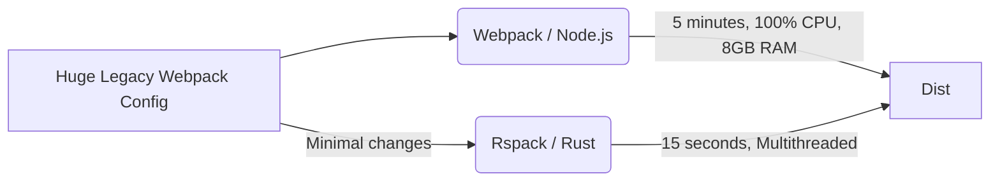

# Rspack

**Rspack** — это сверхбыстрый бандлер, написанный на языке Rust, разработанный компанией ByteDance (создатели TikTok). Его главная киллер-фича — практически 100% совместимость с экосистемой, API и конфигурацией **Webpack**, но при этом он работает в 10–50 раз быстрее.

## Боль, которую мы решаем

Крупные Enterprise-проекты живут на Webpack годами. У них огромные `webpack.config.js` на тысячи строк, самописные плагины, лоадеры и сложная логика разделения кода. 
Со временем сборка таких проектов начинает занимать 5–10 минут, а перезагрузка страницы в Dev-режиме (HMR) — по 10 секунд. Разработчики хотят скорости (как у Vite или esbuild), но **переписать** архитектуру гигантского проекта на Vite слишком дорого и рискованно. Нужно что-то, что можно просто "вставить вместо Webpack" (drop-in replacement), и чтобы всё ускорилось само.

## Как это работает на практике

Rspack берет архитектуру Webpack (сборка графа зависимостей, лоадеры, плагины) и реализует её на Rust. Rust позволяет использовать многопоточность и не страдает от пауз сборщика мусора (Garbage Collector), от которых "умирает" Node.js при сборке тяжелых бандлов.

Вы берете свой старый проект на Webpack, меняете в `package.json` пакет `webpack` на `@rspack/cli`, меняете `webpack.config.js` на `rspack.config.js` (с минимальными изменениями) — и сборка ускоряется с 5 минут до 15 секунд.



## Пример миграции

**Было (Webpack):**
```javascript
const HtmlWebpackPlugin = require('html-webpack-plugin');
module.exports = {
  entry: './src/index.js',
  plugins: [new HtmlWebpackPlugin()]
};
```

**Стало (Rspack):**
```javascript
// Конфиг выглядит почти идентично, плагины встроены "из коробки" для максимальной скорости
const rspack = require('@rspack/core');
module.exports = {
  entry: './src/index.js',
  plugins: [new rspack.HtmlRspackPlugin()] // Аналог на Rust
};
```

## Неочевидные нюансы и трейдоффы

1. **Не 100% плагинов поддерживается:** Хоть Rspack и стремится к полной совместимости, если ваш проект использует очень редкий или самописный Webpack-плагин, который глубоко лезет в AST-дерево Webpack через JavaScript API, он может не завестись или работать медленно (передача данных между Rust и JS-лоадерами съедает производительность).
2. **Rsbuild:** Rspack — это низкоуровневый движок (как Webpack). Над нимByteDance сделали абстракцию **Rsbuild** — аналог Create React App или Vite, который дает готовую сборку (Zero Config) для React/Vue из коробки.
3. **Замена Turbopack:** Vercel параллельно пилит свой "убийцу Webpack на Rust" — Turbopack (специально для Next.js). Rspack — это прямой конкурент Turbopack, но с фокусом на универсальность и совместимость со всем legacy, а не только с Next.js.
