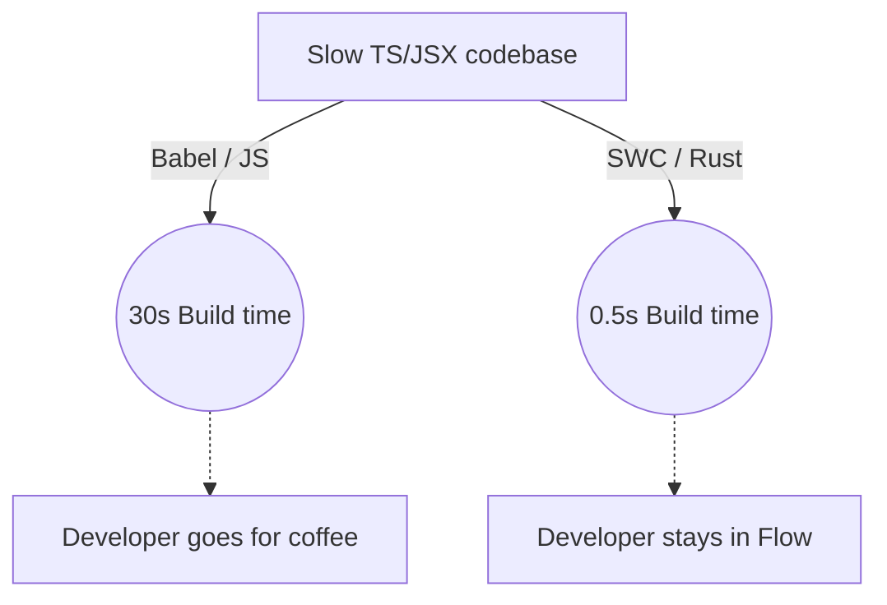

# SWC (Speedy Web Compiler)

**SWC** — это сверхбыстрый компилятор (транспилятор) для JavaScript/TypeScript, написанный на языке Rust. Он создавался как прямая и гораздо более производительная замена легендарному **Babel**.

## Боль, которую мы решаем

С ростом кодовой базы транспиляция через Babel (написанный на медленном JavaScript) становится узким местом. В крупных монорепозиториях сборка может занимать минуты, а при каждом сохранении файла разработчик ждет по несколько секунд, пока Babel пережует AST и отдаст новый бандл. Это убивает Flow разработчика.

## Как это работает на практике

Rust компилируется напрямую в машинный код, эффективно управляет памятью и не имеет пауз сборщика мусора. В результате парсинг, трансформация AST и генерация кода происходят в **20–70 раз быстрее**, чем в Babel.

SWC умеет брать современный TypeScript или React (JSX) и за миллисекунды превращать его в JavaScript, понятный старым браузерам, параллельно выполняя минификацию.

## Где применимо и кто использует

SWC сегодня — это индустриальный стандарт нового поколения.
- **Next.js** с версии 12 полностью выкинул Babel и перешел на встроенный SWC, что ускорило сборку Next-приложений в 5 раз.
- **Parcel** под капотом использует SWC для транспиляции.
- **Turbopack** (новый сборщик от Vercel) построен вокруг SWC.

## Неочевидные нюансы и трейдоффы

1. **Экосистема плагинов:** Главный минус SWC — бедная экосистема кастомных плагинов по сравнению с Babel. Плагины для SWC нужно писать на WebAssembly или Rust (что повышает порог входа). Если в вашем старом проекте есть самописный сложный Babel-плагин, миграция на SWC может стать блокирующей проблемой.
2. **Type Checking:** Как и Babel, SWC **не проверяет типы**. Он просто "вырезает" TypeScript синтаксис (Type Stripping). Если вы напишете `const a: number = 'string'`, SWC радостно и за миллисекунду скомпилирует это без ошибок. Поэтому в пайплайне всё равно нужно отдельно запускать `tsc --noEmit` для проверки типов.
3. **SWC vs esbuild:** Оба невероятно быстрые. Но `esbuild` написан на Go и фокусируется на бандлинге, в то время как SWC (на Rust) изначально фокусировался именно на сложной трансформации кода (полифиллы для старых браузеров), где он показывает лучшие результаты.
