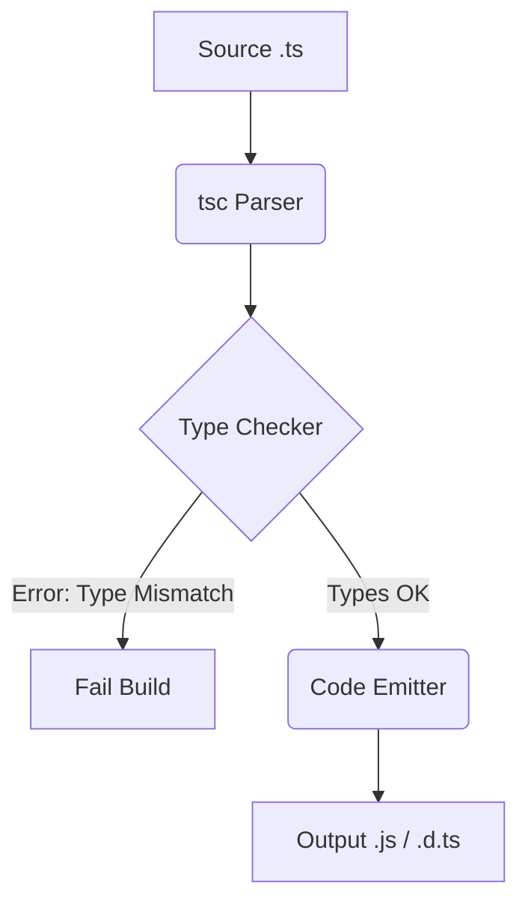

# TypeScript Compiler (tsc)

**`tsc`** — это официальный компилятор от Microsoft для языка TypeScript. Его задача — прочитать код с типами (`.ts`, `.tsx`), проверить его на логические ошибки и выдать на выходе чистый JavaScript (`.js`), удалив всю информацию о типах.

## Боль, которую мы решаем

JavaScript — язык с динамической типизацией, где ошибки вроде `undefined is not a function` "всплывают" только в браузере у пользователя. `tsc` решает эту проблему, выполняя **статический анализ** до запуска кода.

## Как это работает на практике

`tsc` работает в две фазы, которые логически независимы:
1. **Type Checking (Проверка типов):** Анализ графа зависимостей, выведение типов (Type Inference) и поиск ошибок (например, вызов несуществующего метода).
2. **Emit (Генерация кода):** Удаление интерфейсов, типов и (опционально) транспиляция современного синтаксиса в старый (ES5).

## Архитектурный антипаттерн в Build System

**Антипаттерн:** Использовать `tsc` как основной бандлер или транспилятор в пайплайне сборки (например, использовать `ts-loader` в Webpack, который проверяет типы при каждой пересборке). 
`tsc` написан на JavaScript и является **очень медленным** инструментом из-за сложности системы типов TypeScript. Ожидание сборки будет мучительным.

**Правильное решение:** 
Разделение ответственности (Type Stripping).
1. Для трансформации TS в JS используем сверхбыстрые `esbuild` или `SWC` (они просто вырезают типы за миллисекунды, вообще их не проверяя).
2. Параллельно (в другом процессе или в CI) запускаем `tsc --noEmit`, который делает **только** проверку типов, не тратя время на генерацию файлов. Это называется "Type Checking in background".

## Неочевидные нюансы и трейдоффы

1. **Генерация .d.ts:** Если вы пишете NPM-библиотеку в монорепозитории, вам жизненно необходим `tsc` для генерации файлов деклараций (`.d.ts`). `esbuild` и `SWC` не умеют генерировать `.d.ts`.
2. **Project References:** В больших монорепозиториях один прогон `tsc` может занимать минуты. Для ускорения используют флаг `--build` и настройку `composite: true` (Project References), чтобы `tsc` кешировал проверки и проверял только измененные воркспейсы.
3. **Небезопасный Emit:** По умолчанию `tsc` сгенерирует `.js` файл даже если в коде есть ошибки типов (в отличие от компиляторов Java или C#). Чтобы запретить это, нужно строго указать `noEmitOnError: true` в `tsconfig.json`.
