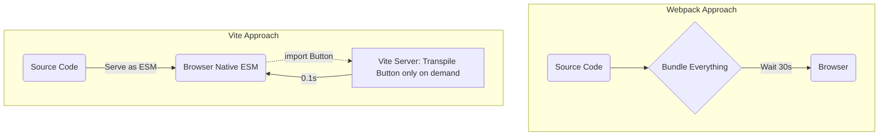

# Vite

**Vite** (от фр. "быстрый") — это инструмент нового поколения для фронтенд-разработки, созданный Эваном Ю (автором Vue.js). Он радикально изменил подход к Dev-серверу и сборке, став фактическим стандартом (заменив Create React App и Webpack во многих новых проектах).

## Боль, которую мы решаем

С классическими бандлерами (Webpack, Parcel) старт локального Dev-сервера крупного проекта занимает 30–60 секунд. Бандлеру нужно собрать **весь** граф зависимостей в один гигантский бандл до того, как страница загрузится в браузере. При сохранении файла (HMR) бандлер перестраивает часть этого графа, что в огромных проектах может занимать 2-5 секунд. Разработчик нажал `Ctrl+S`, перевел взгляд на браузер — а изменения еще не применились.

## Как это работает на практике

Vite использует принципиально разную архитектуру для разработки и для продакшена.

### Dev-сервер (Unbundled Development)
Вместо того чтобы собирать бандл, Vite отдает исходники в браузер как **нативные ES-модули** (`<script type="module">`). 
Браузер сам парсит импорты и запрашивает нужные файлы один за другим.
- **Предварительная сборка зависимостей:** Тяжелые `node_modules` (в которых могут быть тысячи файлов) Vite заранее компилирует через сверхбыстрый `esbuild` (на Go) в единые файлы и жестко кеширует.
- **HMR:** Если вы меняете один файл `Button.tsx`, Vite транспилирует (через esbuild) **только этот один файл** и мгновенно отправляет его в браузер через WebSocket. Скорость обновления (HMR) не зависит от размера проекта.

### Prod-сборка
Для продакшена отдавать тысячи мелких файлов через нативный ESM неэффективно (сетевой waterfall). Поэтому для команды `vite build` под капотом используется бандлер **Rollup**, который собирает, минифицирует и делает идеальный Tree-shaking.

## Неочевидные нюансы и трейдоффы

1. **Разница окружений:** Dev-сервер использует esbuild и ESM, а Prod-сборка использует Rollup. Изредка это приводит к "плавающим багам", когда код работает локально, но ломается при сборке в прод (например, из-за разных стратегий поднятия переменных или разного отношения к кривым CommonJS-импортам).
2. **CORS и Микрофронтенды:** Так как Vite в dev-режиме генерирует сотни запросов к локальному серверу, его сложно интегрировать в устаревшие enterprise-архитектуры или сложные iframe/proxy песочницы, требующие хитрого роутинга.
3. **Настоящая скорость:** Vite феноменально быстр, пока вы пишете фронтенд. Но если узкое место вашей системы — это проверка типов TypeScript (которую Vite игнорирует), общая скорость CI-пайплайна останется прежней, потому что `tsc` все равно будет работать свои 2 минуты.
