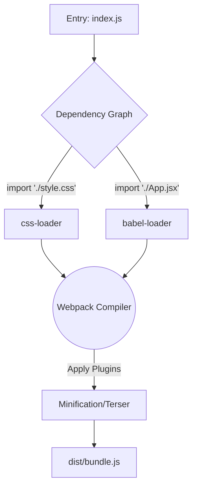

# Webpack

**Webpack** — это "дедушка" современных бандлеров, самый мощный, гибкий и распространенный инструмент в мире фронтенда. Выпущенный в 2012 году, он определил то, как мы собираем веб-приложения на протяжении целого десятилетия.

## Боль, которую мы решаем

До Webpack фронтенд представлял собой хаос из тегов `<script>`, подключенных в `index.html` в строгом порядке, и глобальных переменных (например, `window.$`). Не было стандартизированной модульности, нельзя было импортировать картинки или CSS прямо в JS. Webpack предложил революционную идею: **"Всё есть модуль"**. Вы можете написать `import logo from './logo.png'` — и бандлер сам поймет, как это обработать.

## Как это работает на практике

В основе Webpack лежат две ключевые абстракции:
1. **Loaders (Лоадеры):** Правила, которые говорят: "Если встретишь файл `.scss`, прогони его через `sass-loader`, потом через `css-loader`, потом вставь в страницу через `style-loader`". Лоадеры трансформируют файлы по одному.
2. **Plugins (Плагины):** Инструменты, работающие на уровне всей сборки. Они могут вмешиваться в процесс (hook system) в любой момент: минифицировать весь итоговый бандл, сгенерировать `index.html`, инжектить переменные окружения.

## Трейдоффы и границы применимости

**Плюсы:**
- Невероятная экосистема. Для любой, даже самой безумной задачи (например, "превратить SVG в React-компонент, а затем заинлайнить его в Base64, если он меньше 4KB"), уже есть готовый плагин или лоадер.
- Поддержка Module Federation (архитектура микрофронтендов). Webpack 5 первым внедрил эту технологию, став стандартом де-факто для энтерпрайза.

**Минусы (Где ломается):**
- **Скорость:** Webpack написан на JavaScript. Построение графа зависимостей для 5000 файлов занимает минуты. Проекты "задыхаются" в ожидании сборки.
- **Сложность конфигурации:** `webpack.config.js` может разрастаться до тысяч строк нечитаемого кода, который боятся трогать даже Senior-разработчики. "Config-hell" — это синоним Webpack.
- **Устаревание:** Сегодня индустрия массово мигрирует на более быстрые тулзы на системных языках (Vite, Rspack, Turbopack). Rspack, например, предлагает API Webpack, но на Rust, что делает оригинальный Webpack всё менее актуальным для новых проектов.
