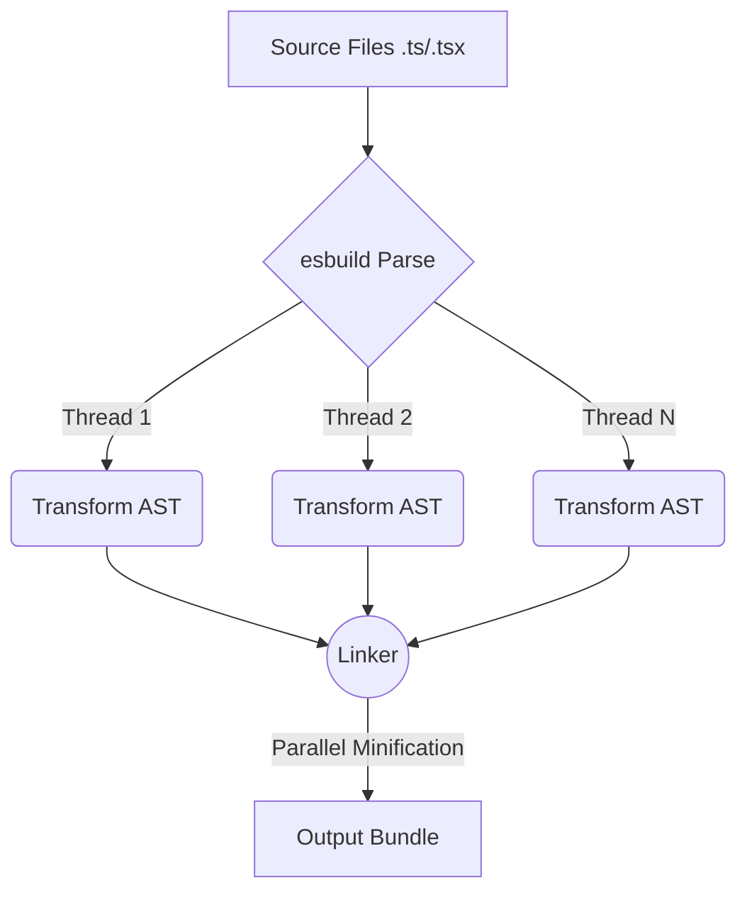

# esbuild

**esbuild** — это бандлер и минификатор для веба, написанный на языке программирования Go Эваном Уоллесом (создателем Figma). Его появление в 2020 году стало настоящим землетрясением в мире фронтенда: он показал, что сборка проекта может быть в **10-100 раз быстрее**, чем мы привыкли думать.

## Боль, которую мы решаем

Сборщики на базе Node.js (Webpack, Rollup, Parcel) достигли физического предела скорости. JavaScript, являясь интерпретируемым языком с JIT-компиляцией, тратит слишком много времени на парсинг AST-деревьев, создание объектов в памяти и работу сборщика мусора (Garbage Collector). Для гигантских проектов холодный старт сборки занимал минуты. Нам нужен был инструмент, работающий "ближе к металлу".

## Как это работает на практике

esbuild написан на Go — компилируемом системном языке.
1. **Жесткая параллельность:** Go изначально создавался для многопоточности. esbuild параллелит абсолютно всё: чтение файлов, парсинг, линковку и минификацию на все доступные ядра процессора.
2. **Нулевые аллокации (почти):** esbuild старается минимально копировать данные в памяти, переиспользуя буферы и избегая создания лишних объектов, что снимает нагрузку с Garbage Collector.

## Где применимо и кто использует

esbuild не пытается заменить Webpack во всём (у него нет такой же гигантской экосистемы плагинов для хитрой обработки CSS-модулей или картинок). Его ниша — это **грубая сила**: невероятно быстрая транспиляция TS/JSX в JS и бандлинг чистого кода.

**Где используется:**
- **Vite:** использует esbuild для мгновенного пре-бандлинга `node_modules` и трансформации TypeScript-файлов на лету в Dev-режиме.
- **Remix:** изначально строился вокруг esbuild как основного бандлера для максимальной скорости (позже перешел на Vite).
- **AWS CDK / Serverless:** esbuild стал стандартом для сборки Lambda-функций на Node.js благодаря способности за долю секунды упаковать код для деплоя.

## Неочевидные нюансы и трейдоффы

1. **Нет проверки типов:** Как и SWC, esbuild просто вырезает TypeScript-аннотации. Он не скажет вам, если вы передадите строку в функцию, ожидающую число. Вам всё еще нужен `tsc --noEmit`.
2. **Размер бандла в проде:** В esbuild реализован хороший, но не идеальный Tree-shaking. В тестах Rollup часто выдает бандлы на несколько килобайт меньше, вырезая мертвый код чуть умнее. Именно поэтому Vite использует esbuild для разработки (где важна скорость), но Rollup для финальной продакшен сборки (где важен каждый байт).
3. **Отсутствие транспиляции для IE11:** esbuild генерирует современный JavaScript (ES6+). Он принципиально не поддерживает конвертацию кода в старый синтаксис (ES5), так как это усложнило бы архитектуру и замедлило бы инструмент. Если вам нужно поддерживать старые браузеры, esbuild вам не подойдет (нужен Babel или SWC).
