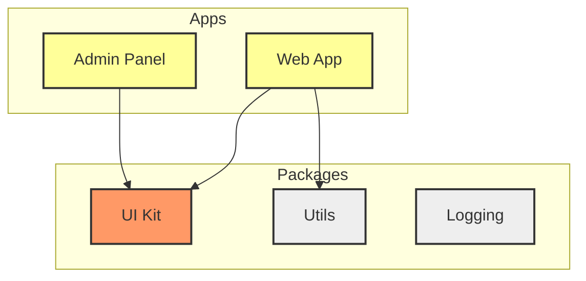

# Affected Projects (Затронутые проекты)

**Affected Projects (Затронутые проекты)** — это ключевая концепция в архитектуре современных монорепозиториев (Nx, Turborepo), позволяющая выполнять команды (сборка, тесты, линтинг) только для той части кодовой базы, которая реально изменилась.

## Боль, которую мы решаем

Представьте монорепозиторий, в котором лежат 5 приложений (B2C, Админка, Мобилка) и 50 общих пакетов (UI Kit, Utils, API Clients). Вы делаете Pull Request: исправляете опечатку в кнопке в `UI Kit`. 
Если на CI вы запустите `npm run build` и `npm run test` для **всего** репозитория, ожидание составит 40 минут. Тратить 40 минут машинного времени на каждую опечатку — это прямой путь к разорению на счетах за CI-серверы и выгоранию разработчиков.

## Как это работает на практике

Инструменты управления монорепозиторием (например, Nx) умеют строить **Граф Зависимостей (Dependency Graph)**. Они анализируют `package.json` и импорты в коде, понимая, кто от кого зависит.

Когда вы делаете PR, инструмент сравнивает вашу текущую ветку с веткой `main` (через `git diff`) и находит измененные файлы. Затем он накладывает эти файлы на граф и вычисляет путь "наверх".



*Пример (на схеме выше):* 
1. Разработчик изменил код в `UI Kit` (оранжевый).
2. Система видит, что от `UI Kit` зависят `Web App` и `Admin Panel` (желтые).
3. Пакеты `Utils` и `Logging` (серые) не зависят от `UI Kit`.
4. Команда `nx affected:build` соберет только желтые и оранжевый кубики. Серые кубики будут проигнорированы.

## Пример команды

В Nx это делается одной строкой:
```bash
# Запустить тесты только для измененных проектов и тех, кто от них зависит
nx affected --target=test --base=origin/main
```

## Неочевидные нюансы и трейдоффы

1. **Влияние файлов вне проектов:** Что делать, если разработчик изменил корневой `package.json` или `tsconfig.json`? В этом случае ломается инкрементальность: система считает, что изменилось "глобальное окружение", и пометит как `affected` **вообще все** проекты в репозитории, запуская полную 40-минутную пересборку.
2. **Точность графа:** Если вы используете Turborepo, он строит граф только на основе зависимостей в `package.json`. Если вы импортировали файл напрямую из соседней папки в обход `package.json` (голый относительный импорт `../../`), Turborepo этого не увидит, и ваш проект не попадет в список `affected`, что приведет к пропущенным багам. Nx умеет анализировать реальные AST-импорты в TS-файлах, что делает его граф более точным.
