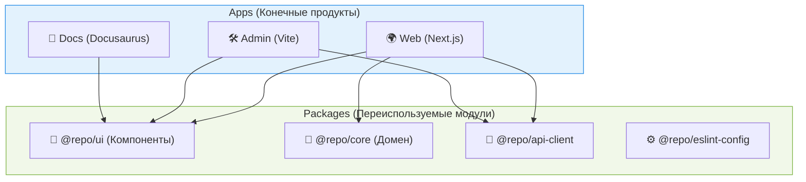

В экосистеме монорепозиториев разделение кода на `Apps` (Приложения) и `Packages` (Пакеты) — это фундаментальный паттерн, обеспечивающий масштабируемость и переиспользование логики.

## 1. Концепция: Зачем нам два типа проектов?

Главная идея: **Приложения (Apps) собирают логику воедино для деплоя, а Пакеты (Packages) инкапсулируют эту логику.**



## 2. Роли и ответственности

### Packages (Пакеты)
* **Что это:** Изолированные библиотеки, утилиты, конфигурации или UI-киты.
* **Правило:** Пакет **ничего не знает о том, где он используется**. Он не должен содержать специфичных для приложения переменных окружения (ENV).
* **Жизненный цикл:** Пакеты импортируются другими пакетами или приложениями. Могут публиковаться в npm, а могут оставаться только внутренними (Internal Packages).
* **Примеры:**
  * `@acme/ui` — общие React-компоненты.
  * `@acme/utils` — функции-хелперы (форматирование дат, парсинг URL).
  * `@acme/tsconfig` — общие настройки TypeScript.

### Apps (Приложения)
* **Что это:** Точки входа (Entry Points) для конечных пользователей.
* **Правило:** Приложение может зависеть от множества пакетов, но **пакет никогда не должен зависеть от приложения**. Приложения не должны импортировать друг друга (Web не импортирует Admin).
* **Жизненный цикл:** Приложения деплоятся (Vercel, Docker, S3). Они **не публикуются** в npm.
* **Специфика:** Именно в `Apps` хранятся `.env` файлы, настраивается роутинг, глобальные провайдеры (Redux Store, Theme Provider).

## 3. Пример кода (Антипаттерн vs Как надо)

### 🔴 Антипаттерн (Утечка контекста в Пакет)
Представим, мы создаем компонент кнопки логина в пакете `@repo/ui`.
```tsx
// packages/ui/src/LoginButton.tsx
export function LoginButton() {
  // ОШИБКА: Пакет зависит от переменной окружения приложения!
  // В Admin панели этот URL может быть другим.
  const apiUrl = process.env.NEXT_PUBLIC_API_URL; 
  
  return <button onClick={() => fetch(apiUrl)}>Login</button>;
}
```

### 🟢 Как надо (Dumb Components & Dependency Injection)
Пакет должен ожидать данные извне.
```tsx
// packages/ui/src/LoginButton.tsx
interface Props {
  onLogin: () => void; // Приложение само решит, куда слать запрос
}
export function LoginButton({ onLogin }: Props) {
  return <button onClick={onLogin}>Login</button>;
}

// apps/web/src/pages/index.tsx
import { LoginButton } from '@repo/ui';
import { api } from '@repo/api-client'; // Еще один пакет!

export default function HomePage() {
  const handleWebLogin = () => api.post('/web-login');
  return <LoginButton onLogin={handleWebLogin} />;
}
```

## 4. Скрытые нюансы: Сборка пакетов (Bundling)

Самый большой холивар в монорепозиториях: **Нужно ли компилировать/собирать внутренние пакеты?**

**Подход 1: Source-code sharing (Рекомендуется)**
В `package.json` пакета вы указываете `"main": "./src/index.ts"`. Вы не настраиваете Webpack/Rollup внутри пакета. Сборку берет на себя фреймворк приложения (например, Next.js или Vite через `transpilePackages`).
* *Плюс:* Максимальная скорость разработки (HMR работает мгновенно). Меньше конфигов.
* *Минус:* Если приложение (Web) и пакет используют несовместимые фичи TS, сборка упадет.

**Подход 2: Pre-bundled packages**
Каждый пакет имеет свой шаг `build` (через tsup, rollup или vite) и отдает в `"main": "./dist/index.js"`.
* *Плюс:* Полная изоляция. Можно писать приложения на разных фреймворках, не заботясь о том, как пакет скомпилирован.
* *Минус:* Медленнее. При изменении пакета нужно дождаться его билда, прежде чем приложение подхватит изменения (решается через `--watch` моды, но это лишний оверхед).
