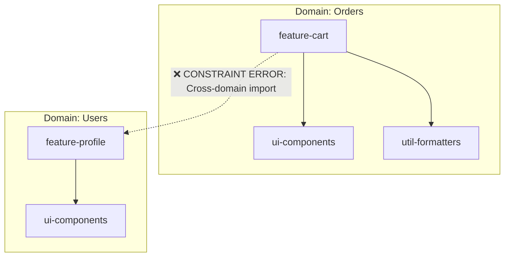

# Dependency Constraints (Ограничения зависимостей)

**Dependency Constraints (Ограничения зависимостей)** — это механизм статического анализа в монорепозиториях, который запрещает определенным пакетам или модулям импортировать другие пакеты на основе заранее заданных правил. Это защита архитектуры от "макаронного кода" (spaghetti code).

## Боль, которую мы решаем

В монорепозитории, где лежат десятки пакетов, нет физических преград для импортов. Разработчик фичи "Корзина" может случайно (или из лени) импортировать утилиту напрямую из фичи "Профиль пользователя", вместо того чтобы вынести утилиту в общий пакет `shared-utils`. 
Со временем граф зависимостей превращается в хаос:
- Возникают **циклические зависимости** (A зависит от B, B от A), которые крашат сборщики.
- Нарушается слоистая архитектура (например, UI-компоненты начинают импортировать классы для работы с Базой Данных).
- "Умные" фичи начинают зависеть друг от друга, усложняя их переиспользование.

## Как это работает на практике

Инструменты (например, ESLint или модули Nx) позволяют настроить теги для пакетов (например, `type:ui`, `type:feature`, `domain:orders`) и прописать правила, кто кого может импортировать.



## Пример конфигурации (Nx / ESLint)

В Nx это настраивается через плагин `@nx/enforce-module-boundaries` в `.eslintrc.json`:

```json
{
  "rules": {
    "@nx/enforce-module-boundaries": ["error", {
      "depConstraints": [
        {
          "sourceTag": "type:ui",
          "onlyDependOnLibsWithTags": ["type:util"] // UI может зависеть только от утилит
        },
        {
          "sourceTag": "domain:orders",
          "onlyDependOnLibsWithTags": ["domain:orders", "domain:shared"] // Изоляция доменов
        }
      ]
    }]
  }
}
```
Если разработчик нарушит правило, редактор подсветит строку импорта красным, а CI-пайплайн упадет с ошибкой линтера.

## Неочевидные нюансы и трейдоффы

1. **Оверхед на поддержание тегов:** Чем больше пакетов, тем сложнее становится поддерживать матрицу тегов и правил. Разработчики начинают тратить часы на то, чтобы "уговорить линтер" разрешить нужный импорт, или придумывают костыльные общие пакеты.
2. **Feature Sliced Design (FSD):** Концепция Dependency Constraints идеально ложится на архитектурную методологию FSD, где слои (app, pages, widgets, features, entities, shared) имеют строгую направленность импортов (только сверху вниз). Линтер делает эти архитектурные правила физически нерушимыми.
3. **Escape Hatches (Лазейки):** Иногда бизнесу нужно срочно выкатить фичу, нарушающую архитектуру (например, жестко связать Корзину и Профиль для A/B теста). Жесткие constraints блокируют такую работу. В ESLint для этого приходится писать уродливые комментарии `// eslint-disable-next-line`.
