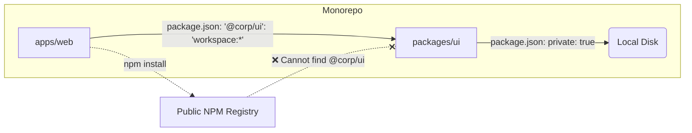

# Internal Packages (Внутренние пакеты)

**Internal Packages (Внутренние пакеты)** — это пакеты в монорепозитории, которые существуют исключительно для разделения и переиспользования кода между приложениями внутри компании, но **никогда не публикуются** в публичный npm-реестр (или приватный Nexus/Artifactory).

## Боль, которую мы решаем

Исторически, чтобы пошарить код (например, UI Kit) между двумя приложениями, нужно было:
1. Создать отдельный репозиторий для UI Kit.
2. Настроить там сборку (Webpack/Rollup), линтеры, CI/CD.
3. Опубликовать версию `1.0.0` в приватный npm-реестр.
4. В приложении обновить версию UI Kit, скачать, понять, что есть баг.
5. Вернуться в п.1, исправить, опубликовать `1.0.1`, обновить...

Этот цикл обратной связи катастрофически медленный. Монорепозиторий решает эту проблему: вы просто кладете UI Kit в соседнюю папку. Но как сказать пакетному менеджеру (pnpm/yarn), чтобы он искал этот пакет не в интернете, а на диске, и при этом не пытался его случайно опубликовать?

## Как это работает на практике

Мы создаем обычный пакет, но в его `package.json` добавляем магическое поле `"private": true`. Это защита от "дурака": команда `npm publish` физически откажется публиковать такой пакет.

А чтобы другие приложения в монорепе могли использовать этот пакет, мы используем **Workspace Protocol** (поддерживается pnpm и yarn).



### Пример конфигурации

**Внутренний пакет (packages/ui/package.json):**
```json
{
  "name": "@my-company/ui",
  "version": "1.0.0",
  "private": true,
  "main": "src/index.ts" 
}
```

**Приложение-потребитель (apps/web/package.json):**
```json
{
  "name": "web-app",
  "dependencies": {
    "@my-company/ui": "workspace:*" 
  }
}
```
*Символ `workspace:*` (или `workspace:^`) говорит пакетному менеджеру (например, pnpm): "Не иди в интернет. Найди этот пакет локально в соседней папке и сделай на него симлинк (symlink)".*

## Неочевидные нюансы и трейдоффы

1. **Транспиляция "на лету":** Самый кайф внутренних пакетов — их можно **не собирать**. Если вы укажете `main` прямо на исходный `.ts` файл, то бандлер основного приложения (Vite/Next.js) сам скомпилирует внутренний пакет при запуске. Это дает идеальный Developer Experience: вы меняете код в UI Kit, и он мгновенно (через HMR) обновляется в браузере запущенного Web App.
2. **Проблема с Docker-деплоем:** Когда вы собираете Web App в Docker для деплоя, просто скопировать папку `apps/web` не выйдет! Пакет зависит от `packages/ui` (через симлинки). Придется копировать весь монорепозиторий в Docker-контейнер и делать сборку внутри, либо использовать тулзы вроде `turbo prune`, которые вырезают только нужный срез монорепы для деплоя.
3. **Отказ от версионирования:** Для внутренних пакетов концепция "версий" (`1.0.0`) теряет смысл. Код всегда находится в актуальном состоянии относительно текущего git-коммита. Если вы ломаете API внутреннего пакета, вы обязаны в этом же PR исправить все приложения, которые его используют.
