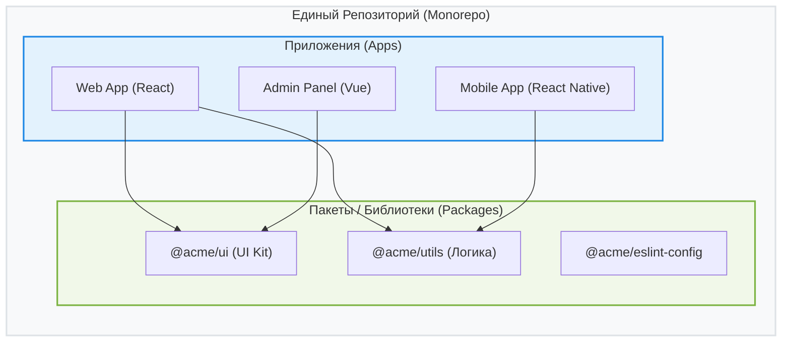

Архитектура Monorepo (монорепозиторий) — это подход к организации исходного кода, при котором код множества проектов (приложений, библиотек, сервисов) хранится в одном едином репозитории системы контроля версий (например, Git).

## 1. Суть концепции

Вместо того чтобы плодить десятки отдельных репозиториев (Polyrepo) для каждого микросервиса, UI-кита или утилиты, весь код компании или крупного продукта живет "под одной крышей". Это решает главную боль распределенных систем — **ад управления зависимостями**.



## 2. Какую боль мы решаем?

В классическом Polyrepo, чтобы обновить кнопку в `UI Kit` и доставить ее в `Web App`, вам нужно:
1. Внести изменения в репозиторий `UI Kit`.
2. Опубликовать новую версию пакета (например, `v1.2.0`) в npm/Nexus.
3. Открыть репозиторий `Web App`.
4. Обновить версию зависимости `UI Kit` в `package.json`.
5. Помолиться, чтобы ничего не сломалось (а если сломалось — повторить цикл).

В Monorepo этот процесс сокращается до одного коммита: вы меняете код кнопки, и `Web App` **мгновенно** видит эти изменения локально, так как проекты связаны через симлинки (symlinks).

## 3. Как это работает на практике

Монорепозитории во фронтенде обычно строятся на базе Workspaces (pnpm, yarn, npm) и систем сборки (Turborepo, Nx, Lerna).

### Пример структуры (pnpm workspaces):
```yaml
# pnpm-workspace.yaml
packages:
  - 'apps/*'
  - 'packages/*'
```

```text
├── apps/
│   ├── web/ (Next.js)
│   └── docs/ (Astro)
├── packages/
│   ├── ui/ (React Components)
│   ├── ts-config/ (Shared TypeScript settings)
│   └── eslint-config/ (Shared Linter rules)
└── package.json
```

### Короткий пример кода (Как надо)
Импорт локального пакета выглядит как обычный импорт npm-модуля.

```tsx
// apps/web/src/App.tsx
import { Button } from '@acme/ui'; // Берется локально из packages/ui
import { formatDate } from '@acme/utils';

export default function App() {
  return <Button onClick={() => alert(formatDate(new Date()))}>Click me</Button>;
}
```

## 4. Скрытые трейдоффы и границы применимости

Несмотря на удобство, у Monorepo есть свои темные стороны.

### Оверхед и проблемы:
* **CI/CD ад:** Если при любом коммите собирать и тестировать *все* проекты, CI будет идти часами. **Решение:** Использование умных билд-систем (Nx, Turborepo), которые умеют строить граф зависимостей и запускать таски только для *затронутых (affected)* проектов.
* **Призрак масштаба:** Git начинает тормозить, когда репозиторий достигает гигантских размеров (миллионы файлов). Для большинства компаний это не проблема, но для Google/Facebook потребовались кастомные VCS.
* **Phantom Dependencies:** Риск использовать библиотеку, которая установлена в корневом `node_modules`, но не прописана в `package.json` конкретного пакета. (Решается использованием `pnpm`).

### Когда использовать не стоит:
* Проекты абсолютно не связаны между собой и разрабатываются независимыми аутсорс-командами.
* У вас строгие требования к доступу: в Monorepo разработчик обычно имеет доступ на чтение ко всему коду. Если нужно скрыть код одного сервиса от разработчиков другого — Monorepo станет болью (потребуются сложные правила доступа на уровне путей).
