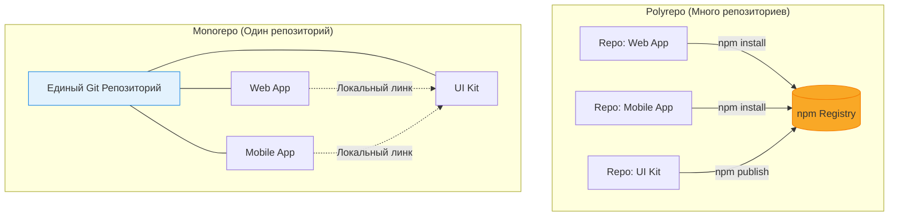

Выбор между Monorepo (единый репозиторий) и Polyrepo (множество репозиториев) — это классический архитектурный спор, где нет серебряной пули. Выбор зависит от размера команды, связанности проектов и зрелости инфраструктуры.

## 1. Суть подходов

* **Monorepo:** Все приложения, библиотеки и конфигурации лежат в одном гигантском репозитории.
* **Polyrepo:** Каждое приложение или микросервис живет в своем собственном, изолированном репозитории. Общий код выносится в отдельные npm-пакеты.

## 2. Сравнение (Боли и Решения)

### Polyrepo (Много репозиториев)
**Плюсы:**
* Идеальная изоляция. Упавший CI в UI-ките не заблокирует деплой мобильного приложения.
* Четкие границы доступа. Легко дать доступ джуниору только к одному некритичному сервису.
* Не требует сложных инструментов. Обычный `npm`, `git` и простой CI/CD пайплайн.

**Антипаттерн Polyrepo (Боль):**
"Бриллиантовая зависимость" и ад версий. 
У вас есть 10 микро-фронтендов, использующих `@company/ui-kit`. Выходит критический багфикс. Вам нужно обойти 10 репозиториев, создать 10 веток, обновить версию в 10 `package.json`, пройти 10 Code Review и слить 10 PR. На практике половина проектов так и останется на старых версиях.

### Monorepo (Единый репозиторий)
**Плюсы:**
* **Атомарные коммиты:** Вы можете изменить API общей кнопки и сразу поправить все места ее использования во всех приложениях в рамках одного PR.
* Единый источник истины (Single Source of Truth) для версий внешних зависимостей (например, во всем репо используется строго React 18).
* Простой шаринг конфигураций (ESLint, Prettier, TSConfig).

**Минусы (Трейдоффы):**
* Требует развитой инфраструктуры (Nx, Turborepo).
* Долгий CI, если не настроить кэширование и affected-сборки.

## 3. Неочевидные нюансы: Границы применимости

**Когда выбрать Polyrepo:**
* Вы — аутсорс-студия, и проекты принадлежат разным клиентам.
* У вас Open-Source проект, который должен развиваться абсолютно независимо от коммерческого кода.
* Команды сильно изолированы и используют радикально разные стеки (например, одна пишет на Vue+Vite, другая на Angular+Webpack), и им нечего шарить между собой.

**Когда выбрать Monorepo (Необходимо):**
* Вы строите продуктовую экосистему (Сайт, Админка, Мобилка), которые должны выглядеть одинаково (общая дизайн-система).
* У вас много переиспользуемой бизнес-логики (DTO, валидаторы, API-клиенты).
* Вы хотите внедрить культуру "внутреннего Open Source", где любая команда может легко законтрибьютить в общую библиотеку.
