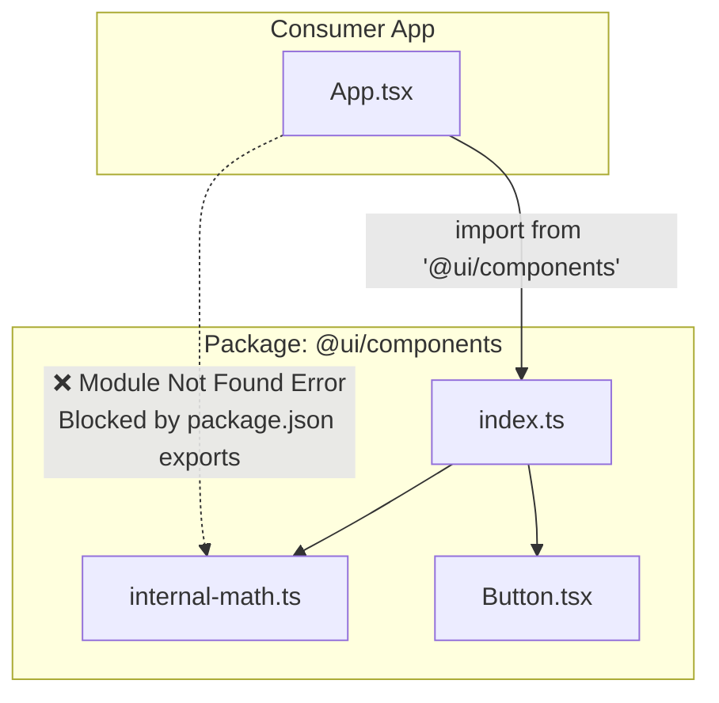

# Package Boundaries (Границы пакетов)

**Package Boundaries (Границы пакетов)** — это концепция жесткой инкапсуляции кода внутри монорепозитория. Это архитектурное правило, гласящее, что пакет должен предоставлять наружу только строго определенный "публичный API" (экспорты), а всё остальное должно быть скрыто и недоступно для других частей системы.

## Боль, которую мы решаем

Представьте пакет `@ui/components`. Внутри у него сложная структура папок:
- `src/components/Button/`
- `src/utils/internal-color-math.ts`
- `src/index.ts` (Публичный API)

Если границ нет, ленивый разработчик из другого приложения может написать:
`import { darken } from '@ui/components/src/utils/internal-color-math.ts'`.

Всё заработает. Но когда авторы `@ui/components` решат порефакторить свои внутренности и переименуют `internal-color-math.ts`, приложение разработчика упадет. Внутренние детали реализации "протекли" наружу (Leaky Abstraction), сделав рефакторинг невозможным.

## Как это работает на практике

Главный инструмент создания железных границ — это поле **`"exports"`** в файле `package.json` (поддерживается Node.js и всеми современными бандлерами).

Оно буквально запрещает любые "глубокие импорты" в обход публичного API.

```json
// package.json внутри пакета @ui/components
{
  "name": "@ui/components",
  "exports": {
    ".": "./src/index.ts",          // Разрешено: import { Btn } from '@ui/components'
    "./styles.css": "./dist/styles.css" // Разрешено: import '@ui/components/styles.css'
  }
}
```



## Неочевидные нюансы и трейдоффы

1. **Барелы (Barrel Files):** Для создания красивого публичного API часто используют файл `index.ts`, в котором пишут `export * from './Button'`. В крупных пакетах такие "бочки" могут привести к проблемам с производительностью сборки и циклическим зависимостям, если бандлер (Webpack/Jest) не умеет делать умный Tree Shaking до парсинга всего файла.
2. **ESLint защита:** Если бандлер старый и игнорирует поле `exports`, границы можно защитить линтером. Правило `no-restricted-imports` позволяет запретить паттерны путей вроде `**/src/**` при импорте из других пакетов.
3. **Версионирование:** Установление строгих границ критически важно для **Семантического версионирования (SemVer)**. Вы можете менять что угодно внутри пакета, и если публичный API (`index.ts`) не изменился, это считается `patch` или `minor` обновлением, а не ломающим `major`. Без границ любое изменение — потенциально ломающее.
