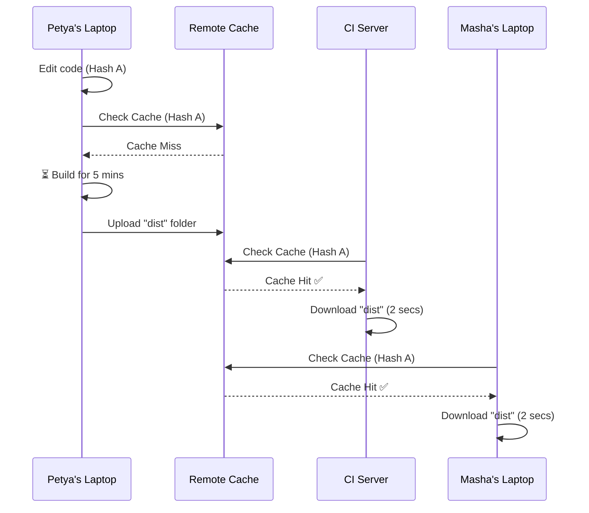

# Remote Cache (Удаленный кеш)

**Remote Cache (Удаленный кеш)** — это технология в современных инструментах сборки монорепозиториев (Turborepo, Nx, Bazel), позволяющая сохранять результаты выполнения ресурсоемких задач (сборки, тесты, линтеры) в облако и переиспользовать их между разными машинами.

## Боль, которую мы решаем

Представьте, что Петя запустил сборку тяжелого UI-кита на своем ноутбуке и прождал 5 минут. Затем он пушит код, и CI-сервер (GitHub Actions) снова собирает этот же UI-кит, тратя 5 минут и сжигая платные минуты. Затем Маша делает `git pull` ветки Пети и тоже ждет 5 минут сборки локально.
**Мы потратили 15 минут времени на сборку абсолютно одного и того же кода.** В масштабах компании это выливается в тысячи потерянных человеко-часов в месяц.

## Как это работает на практике

Инструмент (например, Turborepo) перед выполнением любой задачи высчитывает криптографический **Хэш задачи**. 
Хэш формируется из:
1. Содержимого всех файлов пакета и его зависимостей.
2. Выполняемой команды (например, `tsc --build`).
3. Значений переменных окружения (например, `NODE_ENV`).

Если хэш равен `8f2a1b`, Turborepo стучится в облако (напр. Vercel Remote Cache): "У тебя есть артефакты для задачи `8f2a1b`?". 
- Если **нет (Cache Miss)**: собираем локально и загружаем результат (папку `dist` и логи консоли) в облако.
- Если **да (Cache Hit)**: ничего не собираем! Просто скачиваем готовую папку `dist` из облака за 2 секунды.

## Неочевидные нюансы и трейдоффы

1. **Воспроизводимость сборки (Build Reproducibility):** Remote Cache имеет смысл ТОЛЬКО если ваша сборка детерминирована. Если вы вшиваете в код абсолютные пути с машины Пети (`/Users/petya/project`) или текущую метку времени `Date.now()`, то скачанный на машине Маши кеш будет нерабочим или сломает ей пути.
2. **Безопасность (Secrets Leak):** Если в процессе сборки вы используете приватные ключи (например, `SENTRY_AUTH_TOKEN`) и они случайно попадают в расчет хэша, кеш может инвалидироваться неправильно. Хуже того, кешированные артефакты могут содержать зашитые ключи, поэтому Remote Cache сервер (Vercel, Nx Cloud) должен быть строго приватным в рамках компании.
3. **Оверхед на сеть:** Если проект состоит из тысяч крошечных пакетов, постоянные проверки (ping) и скачивание файлов из облака могут оказаться медленнее, чем просто пересобрать эти пакеты локально с помощью быстрого esbuild. Кешировать нужно только "тяжелые" задачи.
