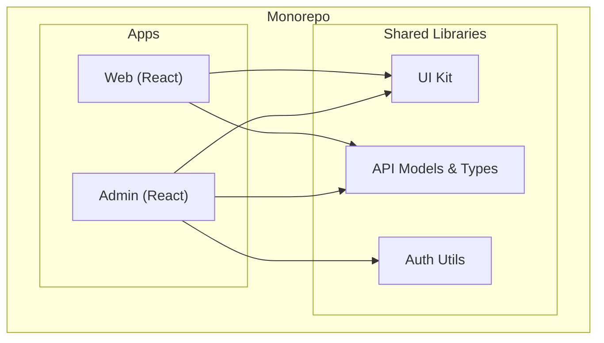

# Shared Libraries (Общие библиотеки)

**Shared Libraries (Общие библиотеки)** — это пакеты в монорепозитории, содержащие код, который используется сразу в нескольких независимых приложениях (Apps) или других пакетах. Самые частые примеры: UI-компоненты, API-клиенты, утилиты валидации и форматирования, общие типы TypeScript.

## Боль, которую мы решаем

Фундаментальный принцип программирования — **DRY (Don't Repeat Yourself)**. Если у вас есть веб-приложение и мобильное приложение на React Native, копирование логики валидации email-адреса или цветов корпоративного бренда в оба проекта приведет к рассинхрону. Когда брендбук поменяется, кто-то обязательно забудет обновить цвета в одном из проектов. Выделение кода в Shared Library создает **Единый источник истины (Single Source of Truth)**.

## Как это работает на практике

В монорепозитории общий пакет обычно лежит в папке `packages/shared-ui` или `libs/utils`. Приложения (Apps) подключают его как зависимость.

При этом сборка настроена так (через Turborepo или Nx), что изменение внутри `UI Kit` автоматически триггерит тесты и пересборку как `Web`, так и `Admin` приложений, чтобы убедиться, что изменения ничего не сломали.

## Трейдоффы и границы применимости (Антипаттерны)

**1. "Божественная библиотека" (God Library):**
Самый частый антипаттерн — создание одного гигантского пакета `packages/common`, куда разработчики "скидывают" всё подряд: от кнопок до функций форматирования даты и настроек логгера.
*Проблема:* При любом изменении (даже добавлении одной картинки) инвалидируется кеш всего пакета, заставляя пересобираться все проекты. Кроме того, бандлер может плохо делать Tree Shaking такого "комка".
*Решение:* Дробить библиотеки по доменам (`packages/ui`, `packages/utils-date`, `packages/logger`).

**2. Жадное переиспользование (Premature Abstraction):**
Разработчик видит похожую логику в двух местах и сразу выносит ее в Shared Library. Но позже выясняется, что в приложении А эта логика должна немного измениться, а в приложении Б — остаться прежней. В общую библиотеку начинают прокидывать десятки `if/else` флагов (например, `isAppA`).
*Правило (AHA-программирование - Avoid Hasty Abstractions):* Лучше иметь небольшое дублирование кода, чем жесткую связь неправильной абстракцией.

**3. Ломающие изменения (Breaking Changes):**
Вынесение кода в Shared Library означает, что изменение интерфейса функции ломает сразу **все** приложения-потребители. В монорепе вы обязаны исправить все сломанные приложения в том же самом Pull Request (Atomic Commits), что может сильно замедлить разработку простой фичи.
