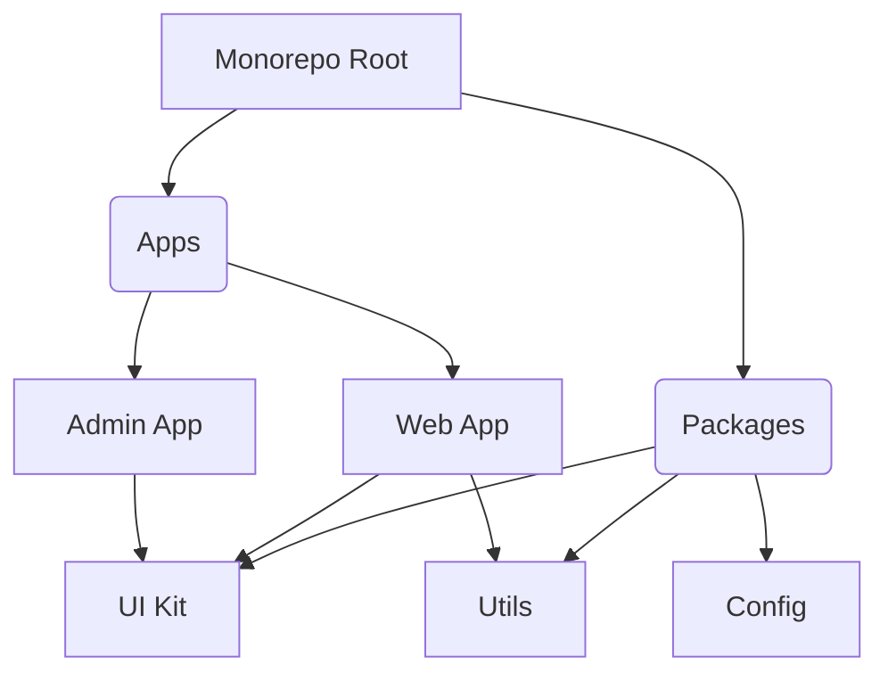

# Monorepo, пакеты и Build System

В современной фронтенд-разработке проекты редко ограничиваются одним SPA-приложением. Со временем кодовая база разрастается: появляются переиспользуемые UI-киты, утилиты, микрофронтенды, B2B и B2C версии продукта. Держать всё это в разрозненных репозиториях (Polyrepo) становится больно: дублирование настроек, сложный шаринг кода, ад зависимостей. 

Здесь на сцену выходят **Monorepo** (монорепозитории) и продвинутые **Build Systems** (системы сборки).

## Боль, которую мы решаем

Когда у вас 10 пакетов и 3 приложения в одном репозитории, возникает ряд проблем:
- **Как не собирать всё подряд?** Если я поменял только кнопку, зачем мне пересобирать админку?
- **Как управлять зависимостями?** Чтобы в пакете A и пакете B была одна и та же версия React.
- **Как версионировать и публиковать?** Выпускать все пакеты синхронно или каждый со своей версией?

## Архитектура решения

## Как это работает на практике

Монорепозиторий — это не просто "свалить весь код в одну папку". Это строгая структура пакетов (Workspaces), управляемая пакетным менеджером (npm/yarn/pnpm) и оркестратором задач (Turborepo, Nx, Lerna). 

Оркестратор строит граф зависимостей: он понимает, что `Web App` зависит от `UI Kit`. Если вы меняете `UI Kit`, он пересоберет и пакет, и зависящее от него приложение, но не тронет соседние, не связанные пакеты. А благодаря **кешированию** (в том числе удаленному), сборка ускоряется в разы, так как результаты предыдущих сборок переиспользуются.

## Трейдоффы и границы применимости

**Плюсы:**
- Единый источник истины (Single source of truth).
- Атомарные коммиты (изменение в библиотеке и приложении в одном PR).
- Простой шаринг кода и общие линтеры/форматтеры.

**Минусы (Где ломается):**
- Огромный размер репозитория (Git может начать тормозить на масштабах Google, хотя для 99% компаний это не проблема).
- Сложный CI/CD пайплайн. Нужно уметь настраивать инкрементальные сборки, иначе CI будет идти часами.
- Высокий порог входа для новых разработчиков — нужно понимать абстракции оркестратора.
