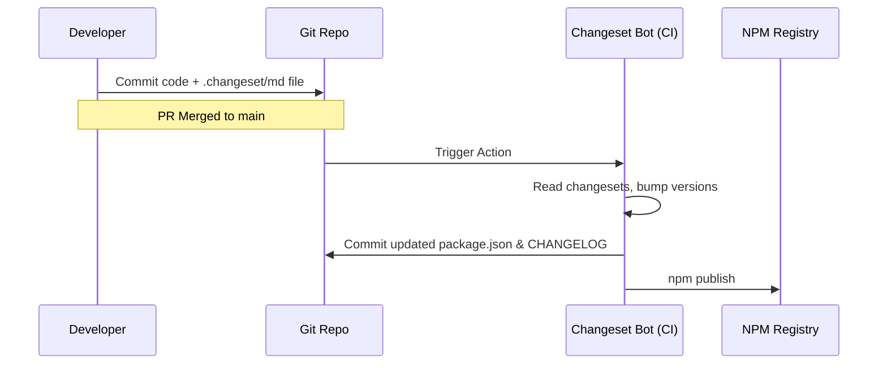

# Changesets

**Changesets** — это современный инструмент для управления версионированием и публикацией пакетов в монорепозиториях. Он смещает фокус с "магического анализа коммитов" (как в Semantic Release) на явные намерения разработчика, оформленные в виде Markdown-файлов.

## Боль, которую мы решаем

В монорепозитории с десятком пакетов управление релизами превращается в кошмар. Вы сделали Pull Request, который добавляет фичу в `UI Kit` и исправляет баг в `Utils`. Как понять, какие версии нужно поднять (patch, minor, major)? Как сгенерировать понятный `CHANGELOG.md` для пользователей?
Раньше команды заставляли разработчиков писать жестко форматированные коммиты (Conventional Commits: `feat(ui): ...`). Но коммиты часто получаются "грязными" (например, `fix: tests`), и генерация красивого чейнджлога из них работает плохо.

## Как это работает на практике

Процесс с Changesets состоит из двух этапов:

1. **Создание намерения (Developer):**
Когда разработчик готов сделать PR, он запускает локально `npx changeset`.
Утилита спрашивает: "Какие пакеты ты изменил? Это major, minor или patch изменение? Напиши summary".
Затем утилита создает в папке `.changeset` файл вроде `fuzzy-bears-jump.md` с описанием. Разработчик коммитит этот файл вместе с кодом.

2. **Релиз (CI/CD):**
На CI настроен бот (Changesets GitHub Action). При мерже PR в `main` бот:
- Читает все файлы из папки `.changeset`.
- Поднимает версии в нужных `package.json` пакетов.
- Обновляет все файлы `CHANGELOG.md`.
- Удаляет прочитанные Markdown-файлы.
- Делает новый коммит, ставит git tag и публикует пакеты в npm (`npm publish`).

## Неочевидные нюансы и трейдоффы

1. **Связанные пакеты (Linked Packages):** Changesets умеет понимать Граф зависимостей монорепы. Если вы сделали ломающее изменение (major) во внутреннем пакете `Utils`, Changesets автоматически поднимет patch-версию для пакета `UI Kit`, который использует эти утилиты, чтобы пользователи `UI Kit` получили новую сборку.
2. **Отложенные релизы:** В отличие от Lerna, которая публикует пакеты прямо во время мержа, Changesets может собирать "намерения" неделями. Бот может создать так называемый "Version PR", куда складывает все изменения. Релизный менеджер заходит раз в неделю, проверяет этот PR, жмет "Merge", и только тогда всё публикуется разом.
3. **Человеческий фактор:** Разработчики часто забывают запустить `npx changeset` перед отправкой PR. Это решается добавлением бота (Changeset Bot), который проверяет PR и пишет комментарий: "Вы изменили код пакета, но не добавили changeset! Пожалуйста, добавьте".
