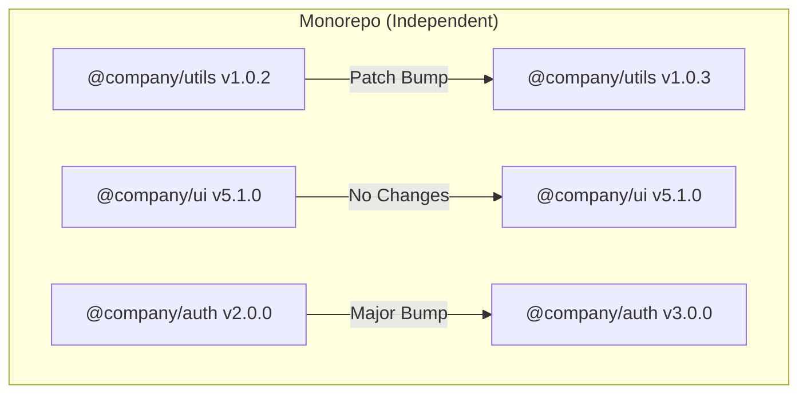

# Independent Versioning (Независимое версионирование)

**Independent Versioning (Независимое версионирование)** — это стратегия в монорепозиториях, при которой каждый пакет имеет свой собственный жизненный цикл и свою версию. Пакет `ui-button` может быть версии `v5.1.0`, в то время как соседний пакет `utils` имеет версию `v1.0.2`.

## Боль, которую мы решаем

Монорепозиторий часто используется не для создания единого фреймворка (как React или Angular), а просто как удобное место для хранения десятков разрозненных NPM-пакетов компании, утилит и микросервисов. 
Если использовать Fixed Versioning, то добавление запятой в документацию пакета `utils` приведет к выпуску новой версии для огромного и критически важного пакета `auth-core`. Пользователи `auth-core` увидят релиз, пойдут читать чейнджлог и не найдут там ничего важного. Это обесценивает версионирование.

## Как это работает на практике

Инструмент релиза (Lerna в режиме `--independent` или Changesets) анализирует граф зависимостей и коммиты. При публикации он поднимает версию **только** у тех пакетов, код которых физически изменился с момента последнего релиза.

## Каскадное обновление (Cascade Bump)

Самый сложный аспект независимого версионирования — это разрешение внутренних зависимостей.
Представьте: `@company/ui` зависит от `@company/utils`. 
Вы сделали ломающее изменение в `utils` (подняли версию `1.0.0` -> `2.0.0`). 
Пакет `ui` **не менялся**, но теперь он должен использовать новую версию `utils`.
Инструмент сборки должен:
1. Автоматически обновить `package.json` внутри пакета `ui` (записать туда `"@company/utils": "^2.0.0"`).
2. Выпустить новую `patch` (или `minor`) версию пакета `ui` — например `v5.1.1` — даже если исходный код компонентов не менялся, так как изменились его зависимости.

## Неочевидные нюансы и трейдоффы

1. **Матрица совместимости:** Если вы пишете набор плагинов, независимое версионирование превратится в ад для пользователей. Им придется гуглить: "А `plugin-router v4.1` совместим с `core-engine v2.8`?". Для тесно связанных экосистем лучше использовать Fixed Versioning.
2. **Сложность CI/CD:** Выпуск 15 разных тегов в Git за один коммит (если обновилось 15 мелких пакетов) может "положить" некоторые слабо настроенные CI-пайплайны или создать хаос в списке релизов на GitHub.
3. **Идеально для UI-китов:** Этот подход идеален для дизайн-систем, где компоненты слабо связаны. Если вы сломали API компонента `<DatePicker>`, вам нужно выпустить Major-релиз только для него, не заставляя пользователей, которым нужна только кнопка `<Button>`, переписывать свой код.
