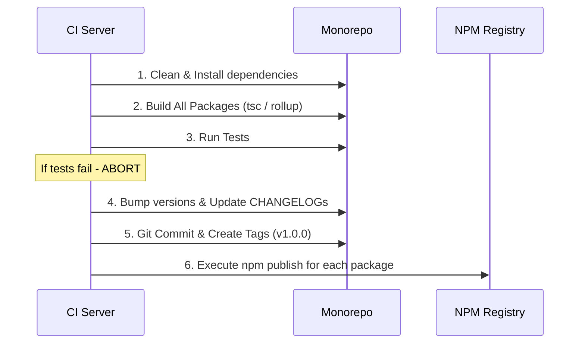

# Package Publishing (Публикация пакетов)

**Package Publishing (Публикация пакетов)** — это финальный этап жизненного цикла библиотеки, на котором артефакты сборки и `package.json` отправляются в реестр пакетов (глобальный NPM Registry или приватный корпоративный Artifactory/Nexus), чтобы другие разработчики могли установить их через `npm install`.

## Боль, которую мы решаем

Опубликовать один пакет просто: написал код, выполнил `npm publish`. Но в монорепозитории процесс превращается в минное поле.
Что если пакет A соберется, а пакет B упадет с ошибкой? Мы получим "частичный релиз".
Что если мы опубликуем исходники TypeScript вместо скомпилированного JS? 
Что если мы забудем обновить версии внутренних зависимостей перед публикацией?

## Как это работает на практике (Пайплайн публикации)

Правильный процесс публикации в монорепе должен быть **полностью автоматизирован** на CI-сервере и состоять из строгих шагов.

## Неочевидные нюансы и трейдоффы

1. **Папка публикации (Publish Directory):**
Частая ошибка новичков — выполнение `npm publish` в корне пакета. В этом случае в реестр улетают все исходники (`src/`, конфигурации тестов, `.eslintrc`), что увеличивает вес пакета. 
**Правильное решение:** Использовать поле `"files"` в `package.json` (белый список папок для публикации, например `["dist"]`), либо копировать нужный `package.json` прямо внутрь папки `dist/` и делать `npm publish ./dist`.

2. **Запрет глубоких импортов внутренних версий:**
Внутри монорепы (с помощью pnpm) пакеты ссылаются друг на друга через `workspace:*`. При публикации этот синтаксис недопустим для внешнего мира. Хорошие инструменты релиза (Changesets, pnpm) автоматически перехватывают процесс публикации и "на лету" заменяют `workspace:*` на конкретные опубликованные версии (например, `^1.2.0`) внутри `package.json`.

3. **Tags и Pre-releases:**
NPM использует систему тегов. Если вы публикуете бета-версию (`v2.0.0-beta.1`) с обычной командой `npm publish`, NPM повесит на нее тег `latest`. В результате все ваши пользователи при `npm install` скачают сломанную бету! 
Пререлизы **обязательно** нужно публиковать с флагом `npm publish --tag beta`. Инструменты автоматизации релиза умеют контролировать это.
