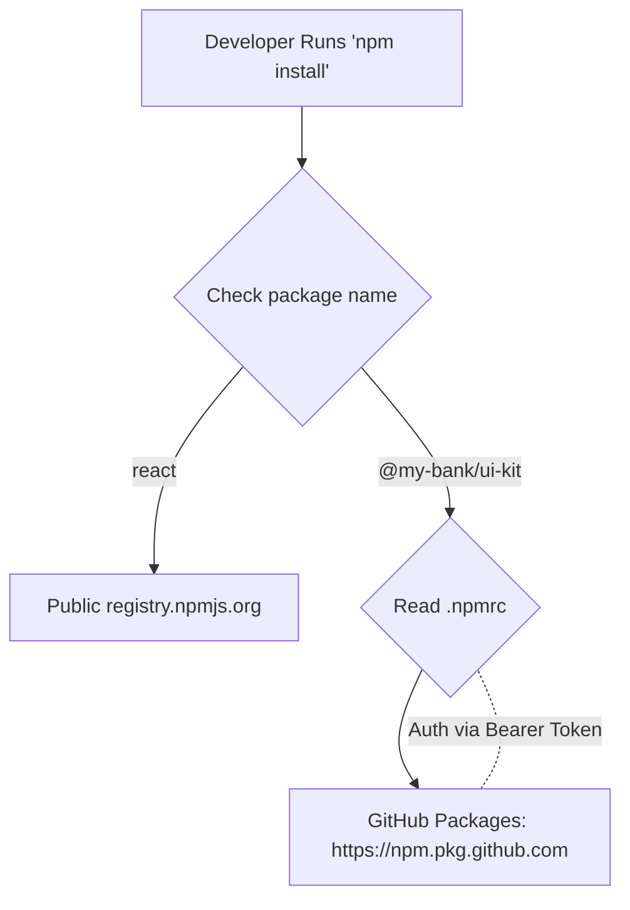

# Private Packages (Приватные пакеты)

**Private Packages (Приватные пакеты)** — это NPM-библиотеки, которые хранятся не в открытом публичном реестре `registry.npmjs.org`, а в закрытом хранилище компании (например, GitHub Packages, GitLab Packages, AWS CodeArtifact или самописном Nexus/Artifactory). Доступ к ним имеют только авторизованные сотрудники или CI-серверы компании.

## Боль, которую мы решаем

Когда крупная корпорация решает вынести общие компоненты в отдельную библиотеку (например, `corporate-ui-kit`), она не может выложить её в публичный NPM. В коде могут быть зашиты коммерческие секреты, логотипы, специфичные для бизнеса алгоритмы, или компания просто не хочет дарить свой труд конкурентам. При этом разработчики хотят устанавливать этот код привычным способом через `npm install @company/ui-kit`.

## Как это работает на практике

Магия приватных пакетов строится на двух вещах: **Scopes** (области видимости) и файле **`.npmrc`**.

1. **Scope:** Все приватные пакеты компании должны иметь префикс, например `@my-bank/`. 
2. **Конфигурация `.npmrc`:** В корне проекта (или на машине разработчика) создается файл `.npmrc`. В нем мы говорим пакетному менеджеру: "Если видишь пакет с префиксом `@my-bank`, не иди в публичный NPM! Иди по вот этому секретному URL и используй вот этот токен".



**Пример `.npmrc`:**
```ini
# Для пакетов @my-bank используем корпоративный реестр
@my-bank:registry=https://npm.pkg.github.com/
# Токен авторизации (берётся из переменных окружения на CI)
//npm.pkg.github.com/:_authToken=${GITHUB_TOKEN}
```

## Неочевидные нюансы и трейдоффы

1. **Утечка токенов:** Разработчики иногда по ошибке жестко хардкодят свой личный токен доступа прямо в `.npmrc` и коммитят его в Git. Это катастрофическая уязвимость. Токены должны подставляться только через переменные окружения.
2. **Кеширование Docker:** При сборке приложения в Docker вам нужно сделать `npm install`. Но Docker не имеет доступа к вашей локальной авторизации или CI-окружению. Вам придется прокидывать секретный `GITHUB_TOKEN` внутрь Docker-образа (используя Docker Secrets или Build Args), что часто приводит к случайному сохранению токена в слоях образа.
3. **Dependabot / Renovate:** Боты, которые автоматически обновляют зависимости в вашем репозитории, "сломаются" об приватные пакеты. Их нужно отдельно авторизовать, настраивая секреты в настройках репозитория.
