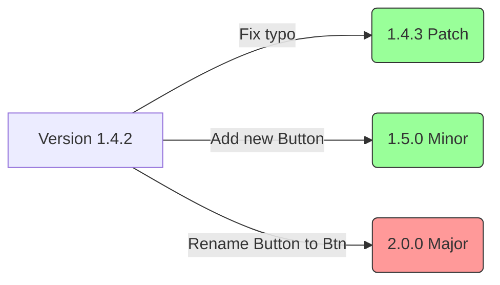

# Semantic Versioning (Семантическое версионирование)

**Semantic Versioning (SemVer)** — это строгий универсальный стандарт формата версий (`MAJOR.MINOR.PATCH`), который превращает номер версии из простого маркетингового числа в жесткий **технический контракт** между автором библиотеки и её потребителем. 

## Боль, которую мы решаем

Исторически разработчики обновляли библиотеки вслепую. Если вышло обновление `jquery v2.0` вместо `v1.9`, никто не знал, что внутри: просто новые фичи, исправления багов или же все старые функции были переименованы, и после обновления ваш сайт рухнет? Из-за этого страха возник паттерн "работает — не трогай", когда проекты годами сидели на дырявых и устаревших зависимостях. 
SemVer дает гарантию: глядя на изменение цифр версии, вы точно знаете, безопасно ли нажимать кнопку "Update".

## Как это работает на практике

Формат версии всегда `X.Y.Z` (например, `2.14.3`). Правила инкрементации строго фиксированы:

1. **PATCH (Z) — 2.14.4:** Исправление багов. Интерфейс (API) не трогали. **Обновляться абсолютно безопасно.**
2. **MINOR (Y) — 2.15.0:** Добавление новых фич. Старый код работает как раньше. **Обновляться безопасно.** (После этого Patch сбрасывается в 0).
3. **MAJOR (X) — 3.0.0:** Ломающие изменения (Breaking Changes). Автор переименовал функцию, удалил метод или изменил тип аргумента. **Обновление сломает ваш код!** Требуется ручной рефакторинг.

## Как это работает в npm (Caret & Tilde)

Благодаря контракту SemVer, пакетные менеджеры могут безопасно обновлять пакеты.
В `package.json` вы часто видите префиксы перед версиями:
- `"react": "^18.2.0"` (**Caret / Каретка**): Разрешено ставить любые Minor и Patch обновления (`18.2.1`, `18.3.0`), но **запрещено** переходить на `19.0.0`, так как Major сломает код.
- `"lodash": "~4.17.20"` (**Tilde / Тильда**): Более строгий вариант. Разрешены только Patch обновления (`4.17.21`), но запрещены Minor. Сейчас используется редко.

## Неочевидные нюансы и трейдоффы

1. **Версия 0.x.x:** Если версия начинается с нуля (например, `0.4.5`), стандарт SemVer **отключается**. Версия `0.y.z` означает, что продукт находится в нестабильной разработке, и ЛЮБОЕ изменение (даже `0.4.6`) может сломать ваш код. `npm` при `^0.4.5` не разрешит автоматическое обновление до `0.5.0`.
2. **Человеческий фактор:** SemVer держится исключительно на совести разработчика. Если автор библиотеки добавит ломающее изменение, но по ошибке выпустит его как `Patch` (`1.4.3`), миллионы CI-пайплайнов по всему миру скачают это "безопасное" обновление (по правилу `^1.4.0`) и упадут.
3. **"Боязнь мажорной версии":** Чтобы не пугать пользователей, некоторые авторы прячут ломающие изменения в Minor-релизы. Это грубейшее нарушение стандарта. Если вы удалили функцию, которой никто не пользовался, это всё равно Major-релиз!
