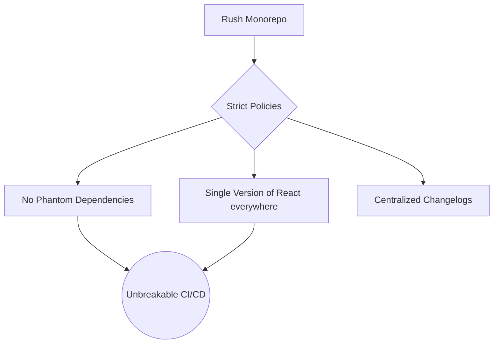

# Rush

**Rush** — это масштабный и строгий инструмент для управления монорепозиториями, созданный и поддерживаемый компанией Microsoft. Он изначально проектировался не для пет-проектов или стартапов, а для управления гигантскими корпоративными репозиториями (сотни пакетов, сотни разработчиков), такими как репозиторий SharePoint.

## Боль, которую мы решаем

Когда в монорепозитории работают 300 разработчиков, классические подходы (Lerna или Yarn Workspaces) начинают давать трещины:
1. **Фантомные зависимости (Phantom Dependencies):** Пакет А может забыть указать библиотеку `lodash` в своем `package.json`, но код будет работать, потому что пакет Б установил `lodash` в корневой `node_modules` (hoisting). На CI этот код внезапно упадет.
2. **Ад разных версий:** В пакете А используется React 17, в пакете Б — React 18. Пакетный менеджер скачивает обе версии, раздувая `node_modules`, и возникают конфликты при шаринге компонентов.
3. **Медленная установка:** `npm install` в гигантской монорепе может занимать десятки минут.

## Как это работает на практике

Rush решает эти проблемы путем установления жесткой диктатуры:

1. **Строгий изолятор зависимостей:** Rush популяризировал использование `pnpm` (или строгого режима npm). Он создает симлинки так, что пакет физически не имеет доступа к зависимостям, которые не указаны явно в его `package.json`. Фантомные зависимости исключены на 100%.
2. **Единая версия для всех (Single Version Policy):** Rush может принудительно заставить всех разработчиков в монорепе использовать строго одну версию любой зависимости. Вы не можете установить `lodash@4` в один пакет и `lodash@3` в другой. Если нужно обновить библиотеку, вы обязаны обновить ее для всего монорепозитория разом.
3. **Глобальный Shrinkwrap:** Rush управляет одним гигантским lock-файлом для всего репозитория, что гарантирует абсолютную детерминированность установки зависимостей для всех команд.

## Трейдоффы и границы применимости

**Плюсы:**
- Неубиваемая надежность. Архитектура не деградирует со временем.
- Встроенная поддержка инкрементальных сборок и публикации пакетов (Changesets-подобная система встроена в Rush).

**Минусы (Где ломается):**
- **Высочайший порог входа:** Конфигурация Rush разбросана по десяткам JSON-файлов в папке `common/config/rush/`. Там нужно настраивать политики, кастомные команды, версии менеджеров. Для новичка это выглядит пугающе.
- **Болезненные обновления:** Из-за правила единой версии (Single Version Policy), обновление мажорной версии библиотеки (например, переход с React 17 на 18) блокирует всю команду. Вам придется переписать код во **всех** 150 пакетах монорепы в рамках одного огромного PR, прежде чем вы сможете замержить это обновление. Для многих команд такая "диктатура" слишком жестока.
