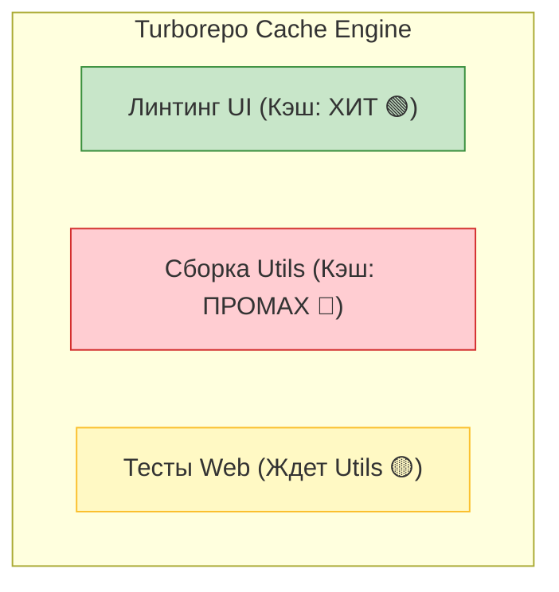

Turborepo — это высокопроизводительная система сборки для JavaScript/TypeScript монорепозиториев, разработанная командой Vercel (создателями Next.js).

## 1. Что это такое и какую боль решает

В монорепозитории главная проблема — время в CI/CD. Когда у вас 50 пакетов и вы меняете один файл в пакете `utils`, традиционные тулзы (вроде Lerna) заставят вас пересобирать, линтить и тестировать *вообще всё*. CI будет идти 40 минут. 

Turborepo решает эту проблему за счет **интеллектуального графа зависимостей** и **агрессивного кэширования**.



## 2. Как это работает на практике

Turborepo анализирует ваши Workspaces (pnpm/yarn) и строит граф выполнения задач на основе файла `turbo.json`.

### Конфигурация (turbo.json)
Здесь описывается топология тасок.
```json
{
  "$schema": "https://turbo.build/schema.json",
  "pipeline": {
    "build": {
      "dependsOn": ["^build"], // Сначала собери зависимости пакета, потом сам пакет
      "outputs": ["dist/**", ".next/**"] // Что кэшировать
    },
    "lint": {
      "dependsOn": [] // Линтинг можно запускать параллельно, никого не ждем
    },
    "dev": {
      "cache": false, // Дев-сервер кэшировать нельзя
      "persistent": true
    }
  }
}
```

### Магия кэширования (Как надо)
Когда вы запускаете `turbo run build`, Turbo делает хэш из:
1. Содержимого файлов пакета.
2. Файлов всех его зависимостей.
3. Команд сборки и environment-переменных.

Если такой хэш уже собирался ранее, Turbo просто **копирует файлы из кэша** (из папки `node_modules/.cache/turbo`). Сборка, которая занимала 5 минут, выполняется за 100 миллисекунд.

## 3. Remote Caching (Распределенный кэш)

Самая киллер-фича Turborepo. Кэш можно хранить не только на локальной машине, но и в облаке (Vercel Remote Cache или кастомный S3).
* Разработчик А собирает пакет `ui`. Результат улетает в облако.
* Разработчик Б делает `git pull` и запускает `turbo build`.
* Turbo видит, что хэши совпали, и скачивает готовую сборку из облака. **Сборка занимает 0 секунд**.

## 4. Скрытые трейдоффы и подводные камни

* **Утечка кэша (Cache Poisoning):** Если вы забудете указать в `inputs` или `dependsOn` какую-то переменную окружения (например, `NEXT_PUBLIC_API_URL`), Turbo закеширует билд с одним URL, и отдаст его для другого окружения. Это частая причина загадочных багов в CI.
* **Отсутствие плагинной системы:** В отличие от Nx, Turborepo не умеет генерировать код (scaffolding) или автоматически обновлять зависимости. Это "просто" очень быстрый и умный runner скриптов.
* **Границы применимости:** Turborepo идеален для экосистемы React/Next.js/Node.js. Если у вас сложный монорепозиторий, включающий Java, Python или Go, лучше посмотреть в сторону Bazel, Pants или Nx.
