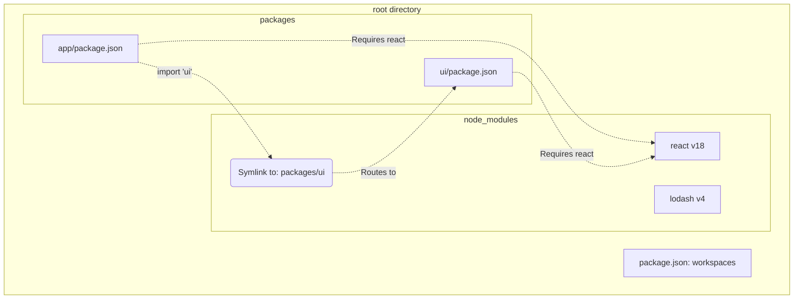

# Yarn Workspaces

**Yarn Workspaces** — это фундаментальная фича пакетного менеджера Yarn, которая стала де-факто стандартом для создания монорепозиториев в экосистеме JavaScript. Yarn был первым массовым менеджером, который внедрил эту концепцию нативно, заставив npm догонять.

## Боль, которую мы решаем

До появления Workspaces (во времена ранней Lerna) связывание пакетов в монорепозитории было ужасным хаком. Пакетный менеджер не знал о монорепозитории. Если пакет `App` зависел от локального пакета `UI`, разработчикам приходилось писать скрипты, которые вручную копировали папку `UI` в `node_modules` приложения `App` или делали хрупкие `npm link`. 
При этом, если оба пакета зависели от `react`, он скачивался на диск дважды.

## Как это работает на практике

Yarn Workspaces переносит концепцию монорепозитория на уровень пакетного менеджера.
Вы указываете в корневом `package.json`:
```json
{
  "private": true,
  "workspaces": ["packages/*"]
}
```

Когда вы делаете `yarn install` в корне, Yarn:
1. **Hoisting (Поднятие):** Анализирует зависимости всех пакетов. Если `packages/app` и `packages/ui` просят `react@18`, Yarn скачает его ровно один раз и положит в **корневой** `node_modules`. Это экономит гигабайты места и ускоряет установку.
2. **Symlinks (Симлинки):** Если `packages/app` зависит от `packages/ui`, Yarn создаст в корневом `node_modules` символическую ссылку на папку `packages/ui`. 

В результате `packages/app` может делать `import { Button } from 'ui'`, и Node.js разрезолвит этот путь прямо в соседнюю папку в исходниках.



## Неочевидные нюансы и трейдоффы

1. **Phantom Dependencies (Фантомные зависимости):** Это главная беда Yarn Workspaces (особенно Yarn v1). Из-за того, что все зависимости "поднимаются" в корневой `node_modules`, пакет `app` может случайно импортировать библиотеку `lodash`, которую он даже не объявлял в своем `package.json`, просто потому, что ее скачал соседний пакет `ui`. На локальной машине всё работает, но при деплое `app` изолированно — он упадет. Эту проблему позже решил `pnpm` (и Yarn v2+ в режиме PnP).
2. **Conflict Resolution (Конфликты версий):** Если пакет `A` требует `react@17`, а пакет `B` требует `react@18`, Yarn не сможет поднять их обе в корень. Он поднимет `react@18` в корень, а `react@17` положит внутрь вложенного `node_modules` пакета `A`. Это может привести к неочевидным багам, когда в браузере загружаются две разные версии React одновременно.
3. **Только установка:** Yarn Workspaces решает **только** проблему установки и связывания зависимостей. Он не умеет оркестрировать сборку (например, "собери UI, а затем App"). Для этого поверх Yarn Workspaces обычно ставят Lerna, Nx или Turborepo.
