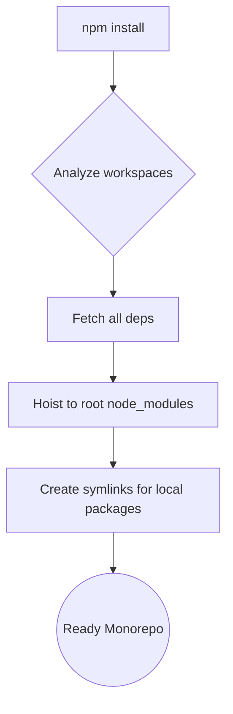

# npm Workspaces

**npm Workspaces** — это встроенный механизм поддержки монорепозиториев в стандартном пакетном менеджере Node.js (`npm`), появившийся начиная с 7-й версии. Долгое время `npm` игнорировал тренд на монорепозитории, отдавая этот рынок `Yarn` и `Lerna`, но в итоге добавил поддержку "из коробки".

## Боль, которую мы решаем

До появления npm v7 разработчики, использовавшие стандартный `npm` для монорепозиториев, страдали. Им приходилось использовать сторонний инструмент (Lerna) с командой `lerna bootstrap`, которая пробегала по всем папкам монорепы, делала там отдельные `npm install`, а затем пыталась связать их локальными ссылками. Это было безумно медленно, жрало гигабайты диска (из-за дублирования `node_modules` в каждой папке) и часто ломалось.

## Как это работает на практике

Сегодня достаточно добавить поле `workspaces` в корневой `package.json`.
```json
{
  "name": "my-monorepo",
  "workspaces": [
    "packages/*"
  ]
}
```

Когда вы делаете `npm install` в корне, npm v7+ ведет себя так же, как Yarn:
1. **Hoisting:** Скачивает все зависимости всех пакетов в единый корневой `node_modules`.
2. **Симлинки:** Создает локальные ссылки для связывания пакетов внутри репозитория.

Кроме того, npm добавил удобный флаг `--workspace` (или `-w`) для запуска скриптов конкретного пакета прямо из корня:
```bash
# Запустить сборку только в пакете UI
npm run build -w packages/ui

# Установить lodash только в пакет Utils
npm install lodash -w packages/utils
```



## Неочевидные нюансы и трейдоффы

1. **Фантомные зависимости (Hoisting Issues):** Как и Yarn v1, `npm` использует плоскую (flat) структуру `node_modules`. Это значит, что все зависимости поднимаются в корень. Пакет может неявно импортировать библиотеку, которую установил его сосед. Строгой изоляции (как в `pnpm`) здесь нет.
2. **Скорость:** Исторически `npm` остается самым медленным пакетным менеджером из "Большой тройки" (npm, yarn, pnpm). В огромных монорепозиториях (50+ пакетов) установка зависимостей через `npm` может занимать неприемлемо долгое время.
3. **Отсутствие оркестрации сборок:** npm workspaces отлично справляются с установкой зависимостей. Но если вам нужно сказать: *"Собери пакет А, а потом пакет Б, потому что Б зависит от А"*, `npm` вам не поможет. Вам всё равно придется использовать поверх него оркестратор задач (Turborepo или Nx).
