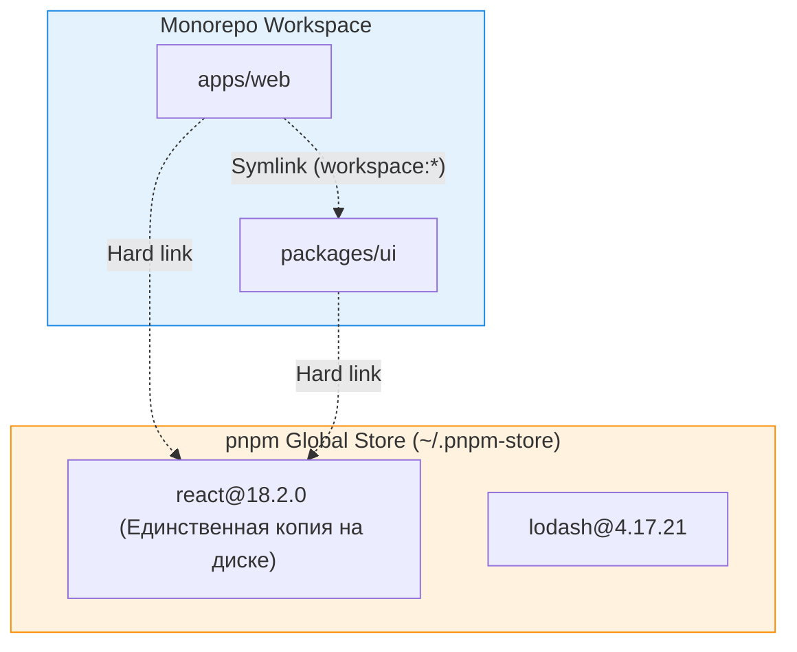

pnpm Workspaces — это встроенный механизм менеджера пакетов pnpm, позволяющий управлять зависимостями множества проектов в рамках одного монорепозитория. 

## 1. Суть и какую боль решаем

В монорепозитории есть две главные проблемы с зависимостями:
1. **Дублирование:** Если у вас 10 пакетов и каждый использует `react`, npm/yarn скопируют `react` 10 раз. Это съедает гигабайты на диске и замедляет установку.
2. **Локальное связывание (Symlinks):** Если `App A` зависит от вашего же локального пакета `Package B`, вам нужно, чтобы изменения в `B` сразу отражались в `A` без необходимости делать публикацию.

pnpm решает обе проблемы блестяще, используя свою фирменную архитектуру жестких ссылок (hard links) и симлинков.



## 2. Как это работает на практике

Настройка невероятно проста. Достаточно создать файл `pnpm-workspace.yaml` в корне проекта.

```yaml
# pnpm-workspace.yaml
packages:
  # Все приложения лежат здесь
  - 'apps/*'
  # Все внутренние библиотеки и UI-киты лежат здесь
  - 'packages/*'
```

### Пример использования (Как надо)

У нас есть пакет `packages/ui` с именем `@acme/ui` в его `package.json`.
Чтобы использовать его в `apps/web`, мы пишем в `apps/web/package.json`:

```json
{
  "name": "web",
  "dependencies": {
    "react": "^18.2.0",
    "@acme/ui": "workspace:*" 
  }
}
```

Протокол `workspace:*` (или `workspace:^`) — это магия pnpm. При локальной разработке pnpm создаст симлинк в `node_modules`. А при публикации в npm он автоматически заменит `workspace:*` на реальную актуальную версию (например, `1.0.5`).

## 3. Фишки и неочевидные нюансы

### Изоляция (Strict Node Modules)
В отличие от npm или Yarn (в классическом виде), pnpm создает плоскую, но строгую структуру `node_modules`.
Если `App A` зависит от `Express`, который в свою очередь зависит от `debug`, вы **не сможете** сделать `import debug from 'debug'` в коде `App A`, если явно не пропишете `debug` в `package.json`. Это называется **Phantom Dependencies** (Призрачные зависимости), и pnpm защищает от них на уровне файловой системы.

### Управление версиями (catalog / overrides)
Если вы хотите, чтобы во всех пакетах монорепы была строго одна версия React (например, чтобы избежать багов с дублированием контекста React):
```json
// package.json (корень)
{
  "pnpm": {
    "overrides": {
      "react": "18.2.0",
      "react-dom": "18.2.0"
    }
  }
}
```

## 4. Границы применимости

* **Когда использовать:** Всегда, когда начинаете новый монорепозиторий в TS/JS. Сегодня pnpm считается де-факто стандартом индустрии для монореп, вытеснив Yarn и npm.
* **Когда НЕ использовать:** 
  * Если ваша инфраструктура (старый CI, специфичные Docker-образы) жестко завязана на npm.
  * Если вы используете React Native — иногда бандлер Metro сходит с ума от строгих симлинков pnpm, требуя дополнительных костылей (через `shamefully-hoist=true` или кастомный резолвер Metro).
