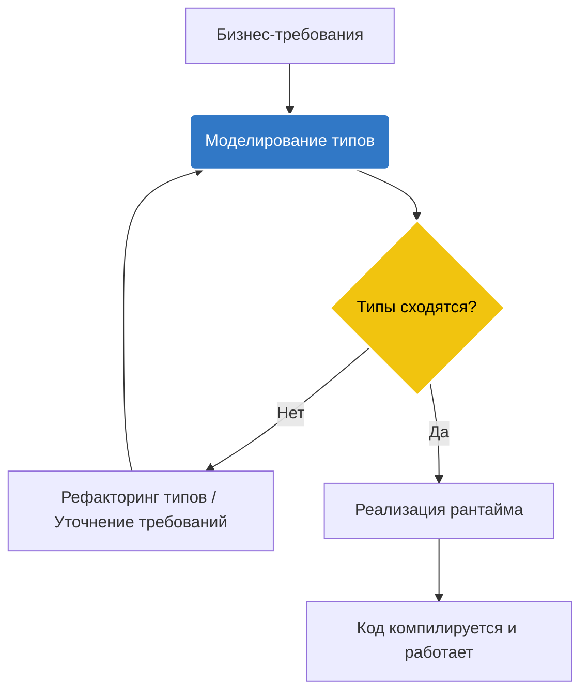

# TypeScript как архитектурный инструмент

В мире фронтенд-разработки TypeScript давно перестал быть просто линтером с проверкой типов. Сегодня это мощный инструмент для проектирования и архитектуры, который позволяет описывать бизнес-логику так, что неверное состояние системы становится непредставимым (Making illegal states unrepresentable). Мы решаем фундаментальную боль — рассинхронизацию между тем, как система задумана, и тем, как она реально себя ведёт. 

С помощью системы типов мы создаем жесткий контракт: "каркас" приложения, вокруг которого уже пишется рантайм-логика. TypeScript берет на себя роль первого рубежа обороны, перехватывая архитектурные ошибки еще на этапе компиляции, а не в момент, когда пользователь нажимает кнопку в браузере.



### Как это работает на практике

Архитектурный TypeScript начинается с описания доменной области. Вместо того чтобы использовать примитивы (`string`, `number`) повсеместно, мы создаем брендированные типы или алгебраические типы данных (ADT), описывая точные состояния системы.

**Антипаттерн:** Использование широких типов и флагов, которые могут конфликтовать.
```typescript
// Плохо: возможны невалидные состояния
interface UserState {
  isLoading: boolean;
  isError: boolean;
  data: User | null;
  error: Error | null;
}

// Что если isLoading === true и isError === true одновременно? 
// Это невалидное состояние, но тип его разрешает.
```

**Правильное решение:** Использование дискриминантных объединений (Discriminated Unions) для точного описания возможных состояний (Finite State Machine).
```typescript
// Хорошо: невалидные состояния непредставимы в системе типов
type UserState =
  | { status: 'idle' }
  | { status: 'loading' }
  | { status: 'success'; data: User }
  | { status: 'error'; error: Error };

function render(state: UserState) {
  // TypeScript заставит нас проверить state.status
  // и не даст обратиться к data, если статус не 'success'
  if (state.status === 'success') {
    console.log(state.data.name);
  }
}
```

### Где применимо, а где ломается (Трейдоффы)

**Применимо:**
- Сложная бизнес-логика и моделирование предметной области (DDD).
- Разработка библиотек и контрактов (API, SDK).
- Команды, где важно самодокументирование кода. Строгие типы — это документация, которая не устаревает.

**Где ломается (Оверхед и нюансы):**
- **Иллюзия безопасности на границах:** TypeScript не существует в рантайме. Если данные приходят с сервера (например, JSON), их типы нужно валидировать (Zod, io-ts). Без этого архитектурный TypeScript превращается в карточный домик: типы говорят одно, а в памяти лежит другое.
- **Оверхед на type-level программирование:** Слишком сложная магия типов (глубокие условные типы, рекурсивные дженерики) сильно замедляет компиляцию (TS Server начинает тормозить) и повышает порог входа для джуниор-разработчиков. Иногда лучше написать чуть больше простого кода, чем один `DeepPartialReadonlyOmit<T>`.
- **Замедление прототипирования:** Когда требования меняются каждый день, жесткий каркас из типов может стать обузой, требуя постоянного рефакторинга интерфейсов до того, как удастся проверить гипотезу.
