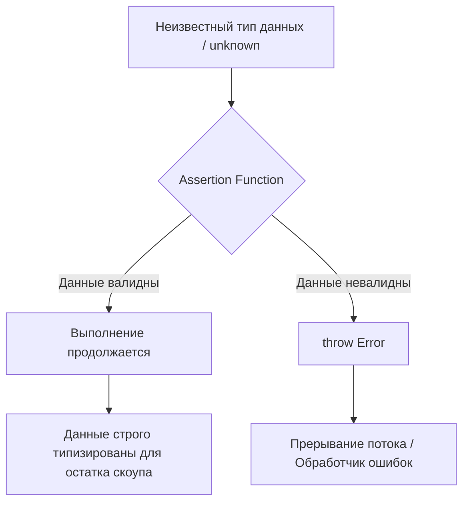

# Assertion Functions

## Суть концепции

В любом приложении возникают ситуации, когда мы *знаем*, что данные должны быть определенного типа на данном этапе выполнения, и если это не так — продолжать работу бессмысленно и опасно. Assertion Functions (функции-утверждения) позволяют выразить эту логику: они либо молча пропускают выполнение дальше, сужая тип переменной до нужного, либо выбрасывают исключение. 

Они решают боль "грязного" кода, когда разработчик вынужден писать бесконечные `if (!user) throw new Error()` перед доступом к свойствам или, что еще хуже, использовать небезопасное приведение типов через `as User`. Assertion Function инкапсулирует эту проверку, сообщая компилятору TypeScript: "Если эта функция отработала и не упала, значит, переменная имеет указанный тип".

## Архитектурная схема



## Как это выглядит в коде

**Антипаттерн (Приведение типов и дублирование логики):**
```typescript
function processUser(user: unknown) {
  // Мы верим на слово, что это объект с полем name. Опасно!
  const u = user as { name: string };
  console.log(u.name.toUpperCase()); 
}
```

**Как надо делать (Assertion Function):**
```typescript
// Ключевое слово asserts говорит TS, что при успешном возврате val является нужным типом
function assertIsUser(val: any): asserts val is { name: string } {
  if (typeof val !== 'object' || val === null || !('name' in val)) {
    throw new Error("Validation failed: Not a user!");
  }
}

function processUser(user: unknown) {
  assertIsUser(user);
  // TypeScript теперь знает, что user имеет поле name
  console.log(user.name.toUpperCase()); 
}
```

## Неочевидные нюансы и границы применимости

1. **Исключения как Control Flow:** Использование Assertion Functions подразумевает генерацию исключений (`throw`). Если в вашей архитектуре принято обрабатывать ошибки функционально (через возврат `Result` или `Either`), этот инструмент сломает конвенцию.
2. **Слепая вера компилятора:** TypeScript никак не проверяет внутренности Assertion Function. Если вы напишете `asserts val is string`, а внутри проверите на число, компилятор поверит вам, и в рантайме случится катастрофа. Вы берете всю ответственность на себя.
3. **Ограничения синтаксиса:** Исторически в TypeScript возникают сложности с написанием assertion functions в виде стрелочных функций (требуется явное указание типа функции), поэтому их почти всегда пишут через классическое объявление `function`.
