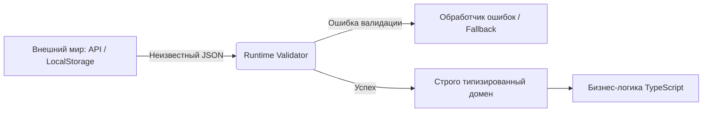

# Runtime Validation (Валидация в рантайме)

## Суть концепции

TypeScript существует только на этапе компиляции. Как только код превращается в JavaScript, все типы исчезают. Это означает, что если вы запрашиваете данные по сети (fetch), читаете из `localStorage` или получаете ввод от пользователя, TypeScript поверит вам на слово, если вы скажете: «это объект `User`». Runtime Validation — это архитектурный паттерн, при котором мы *принудительно* проверяем сырые данные во время выполнения приложения перед тем, как пустить их в нашу бизнес-логику. 

Он решает главную боль типизированного фронтенда: знаменитые ошибки "Cannot read properties of undefined", когда сервер вернул не ту структуру данных, которую ожидал клиент, но TypeScript пропустил это, потому что мы использовали небезопасное приведение типов (`as Type`).

## Архитектурная схема



## Как это выглядит в коде

**Антипаттерн (Ложь компилятору):**
```typescript
interface User { id: number; name: string; }

// TypeScript верит, что data — это User, но сервер может вернуть что угодно.
const response = await fetch('/api/user');
const data = (await response.json()) as User; 

// Упадет в рантайме, если сервер вернул { error: "Not found" }
console.log(data.name.toUpperCase()); 
```

**Как надо делать (Защита границ):**
```typescript
import { z } from 'zod';

// Описываем схему, которая работает в рантайме
const UserSchema = z.object({
  id: z.number(),
  name: z.string()
});
// Выводим TS-тип из схемы (DRY)
type User = z.infer<typeof UserSchema>;

async function fetchUser(): Promise<User> {
  const response = await fetch('/api/user');
  const rawData = await response.json();
  
  // parse выбросит ошибку, если данные не совпадут, не пуская грязь дальше
  return UserSchema.parse(rawData); 
}
```

## Неочевидные нюансы и границы применимости

1. **Производительность:** Валидация JSON-ответов на мегабайты данных может существенно замедлить приложение (блокировка Main Thread). Для огромных массивов иногда применяют ленивую валидацию или валидируют только критичные поля.
2. **Дублирование vs Генерация:** Без библиотек вроде Zod, Valibot или io-ts вам придется писать интерфейсы TypeScript и функции валидации отдельно, что нарушает принцип DRY. Архитектурно правильнее иметь один источник истины (схему), из которого выводится тип.
3. **Границы применимости:** Валидация в рантайме нужна только на "границах" системы (ввод пользователя, сеть, хранилище). Использовать её для проверки данных между внутренними слоями (которые уже типизированы TypeScript) — это оверинжиниринг и лишние накладные расходы.
