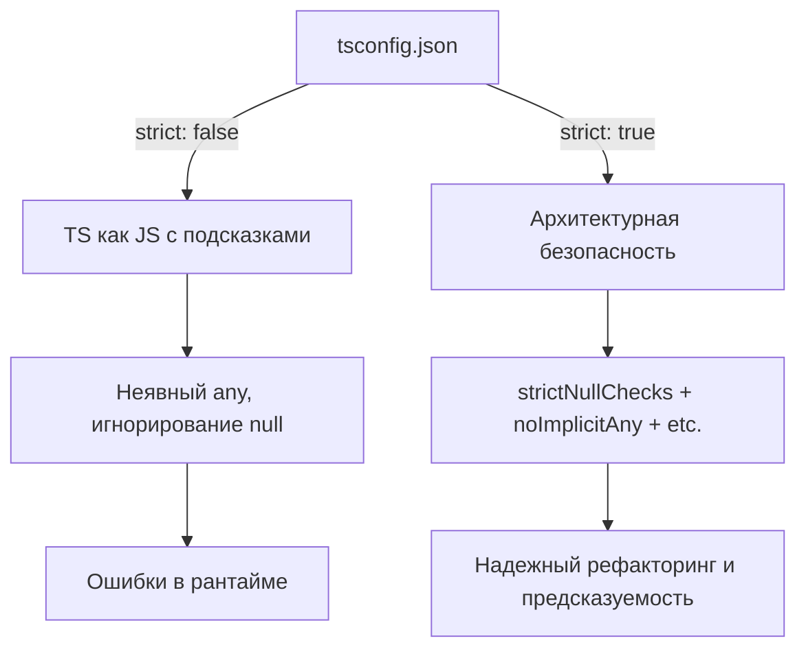

# Strict Mode

## Суть концепции

В TypeScript флаг `strict: true` в конфигурации `tsconfig.json` — это не просто настройка, это философский рубильник. Он включает набор самых жестких проверок типов, заставляя разработчика явно описывать намерения, обрабатывать возможные `null` / `undefined` и избегать неявного `any`. 

Эта концепция решает боль "дырявой" типизации. Без строгого режима TypeScript лишь "слегка подсказывает", позволяя вам передать потенциально отсутствующее значение в функцию, требующую строку, или оставить свойства классов неинициализированными. Strict Mode переводит TS из режима "линтер с типами" в режим "полноценный компилятор, защищающий от выстрела в ногу".

## Архитектурная схема



## Как это выглядит в коде

**Антипаттерн (Поведение при отключенном Strict Mode):**
```typescript
// Без strictNullChecks это скомпилируется!
function printLength(text: string) {
    console.log(text.length);
}

// Передали null, TypeScript промолчал, в рантайме упало: Cannot read property 'length'
let myText = null; 
printLength(myText); 
```

**Как надо делать (Strict Mode включен):**
```typescript
function printLength(text: string) {
    console.log(text.length);
}

let myText: string | null = null;
// TS выбросит ошибку: Argument of type 'null' is not assignable to type 'string'.
// printLength(myText); 

// Вы обязаны явно обработать отсутствие значения:
if (myText !== null) {
    printLength(myText);
}
```

## Неочевидные нюансы и границы применимости

1. **Легаси-кодбазы:** Включение `strict: true` на проекте, который писался без него (или переписывается с JS), — это кошмар, генерирующий тысячи ошибок компиляции. В таких случаях архитекторы включают флаги по одному (начиная с `noImplicitAny`, затем `strictNullChecks`), чтобы плавно мигрировать кодовую базу.
2. **Чрезмерное использование "костылей":** Когда разработчики переходят на строгий режим, но не хотят думать об архитектуре данных, они начинают заваливать код `!` (Non-null assertion operator) и `ts-ignore`. Если вы видите много `foo!.bar`, значит строгий режим вам мешает, так как ваши типы не отражают реальность.
3. **strictPropertyInitialization:** Этот флаг требует, чтобы все свойства класса были инициализированы в конструкторе. Это часто конфликтует с паттернами вроде Dependency Injection в Angular или использованием декораторов-ORM (TypeORM), заставляя ставить тот самый `!` у свойств.
