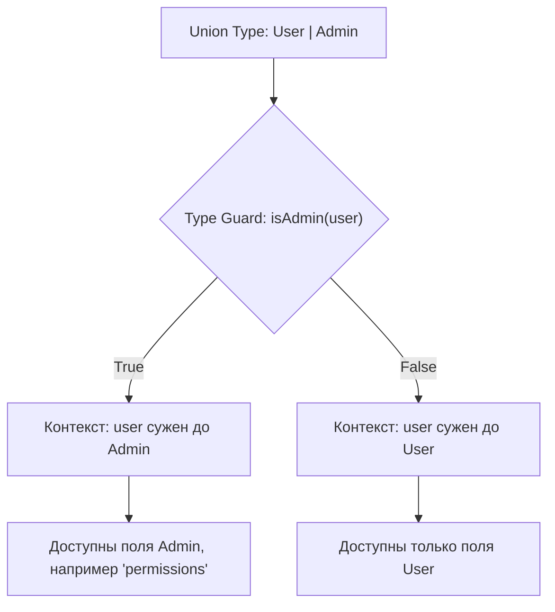

# Type Guards (Защитники типов)

## Суть концепции

Type Guards — это функции (или выражения), которые сужают тип переменной в рамках определенного блока кода. В отличие от *Assertion Functions*, которые прерывают выполнение при ошибке, Type Guards возвращают логическое значение (`boolean`), отвечая на вопрос: "Является ли эта переменная данным типом?". 

Они решают боль работы с объединениями типов (Union Types) и типом `unknown`. Когда в систему приходят полиморфные данные, вам нужно безопасно маршрутизировать их в нужную логику. Type Guard позволяет элегантно проверить структуру и "убедить" TypeScript в том, с чем именно мы работаем, сохраняя функциональный поток управления (через `if / else`).

## Архитектурная схема



## Как это выглядит в коде

**Антипаттерн (Небезопасные проверки и приведение):**
```typescript
type Fish = { swim: () => void };
type Bird = { fly: () => void };

function move(animal: Fish | Bird) {
  // Использование as — это дыра в безопасности типов
  if ((animal as Fish).swim) {
    (animal as Fish).swim();
  } else {
    (animal as Bird).fly();
  }
}
```

**Как надо делать (Пользовательский Type Guard):**
```typescript
type Fish = { swim: () => void };
type Bird = { fly: () => void };

// Возвращаемый тип `animal is Fish` — это и есть Type Guard предикат
function isFish(animal: Fish | Bird): animal is Fish {
  return (animal as Fish).swim !== undefined;
}

function move(animal: Fish | Bird) {
  if (isFish(animal)) {
    // Внутри этого блока TS точно знает, что animal — это Fish
    animal.swim();
  } else {
    // А здесь TypeScript логически выводит, что осталась только Bird
    animal.fly();
  }
}
```

## Неочевидные нюансы и границы применимости

1. **Скрытая ложь в предикатах:** Точно так же, как и с приведением типов, TypeScript *верит* вашей функции-защитнику. Если ваша функция `isFish` вернет `true` для камня, компилятор молча позволит вам вызвать `stone.swim()`, что приведет к падению в рантайме. Type Guard должен быть максимально надежным внутри.
2. **in и typeof:** Часто вам не нужно писать кастомные функции. Встроенные операторы JS (`typeof val === "string"`, `instanceof`, и `"prop" in obj`) автоматически работают как Type Guards в TypeScript. Не пишите свои функции, если можно использовать встроенные возможности языка.
3. **Захламление кодовой базы:** Если у вас слишком много пользовательских Type Guards со сложными проверками объектов (например, проверка каждого ключа в JSON), вам стоит перейти на библиотеки схемной валидации в рантайме (Zod, Valibot), иначе поддержка этих функций превратится в кошмар.
