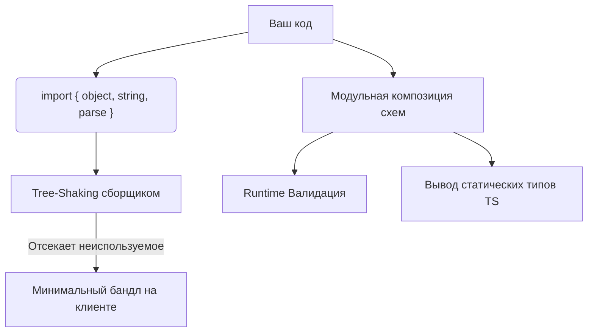

# Valibot

## Суть концепции

Valibot — это современная библиотека для валидации схем в рантайме, главным архитектурным отличием которой является фокус на минимальный размер бандла. В отличие от традиционных решений (таких как Zod или Joi), использующих классы и цепной вызов методов (fluent API), Valibot построен на модульных функциях. 

Эта архитектура решает фундаментальную боль фронтенда: раздувание размера клиентского приложения. Когда вы импортируете Zod, в бандл тащится почти вся библиотека (около 40-50 КБ), потому что методы лежат в прототипах и сборщики (Webpack, Vite) не могут выполнить tree-shaking. Valibot позволяет импортировать только те функции валидации, которые реально используются, сокращая размер бандла для валидации до пары килобайт.

## Архитектурная схема



## Как это выглядит в коде

**Различие с традиционными подходами (Синтаксис Valibot):**

Вместо `z.object({ name: z.string() })` мы используем композицию независимых функций.

**Как надо делать (Композиция функций Valibot):**
```typescript
import { object, string, email, minLength, InferOutput, parse } from 'valibot';

// Схема строится через оборачивание функций
const UserSchema = object({
  name: string([minLength(2, "Имя слишком короткое")]),
  email: string([email("Некорректный email")]),
});

// Вывод типа для TypeScript (DRY)
type User = InferOutput<typeof UserSchema>;

const handleData = (unknownData: unknown) => {
  try {
    // Parse либо возвращает типизированный объект, либо кидает ошибку
    const validUser = parse(UserSchema, unknownData);
    console.log(validUser.name);
  } catch (error) {
    console.error("Ошибка валидации", error);
  }
};
```

## Неочевидные нюансы и границы применимости

1. **Эргономика Developer Experience (DX):** Из-за модульного подхода код на Valibot может выглядеть более "шумным" и вложенным по сравнению с элегантным `z.string().min(2).email()`. Вы жертвуете красотой цепных вызовов ради производительности.
2. **Миграция и Экосистема:** Zod на данный момент является де-факто стандартом индустрии. Для него есть готовые интеграции с React Hook Form, tRPC, OpenAPI-генераторами и т.д. Экосистема Valibot активно растет, но пока вы можете столкнуться с необходимостью писать адаптеры вручную.
3. **Границы применимости:** Valibot идеален для клиентских приложений (браузерных фронтендов, виджетов), где критичен каждый килобайт. Если вы пишете бэкенд на Node.js или внутреннюю админку, где размер бандла не играет роли, переход на Valibot с Zod может не дать ощутимых преимуществ.
