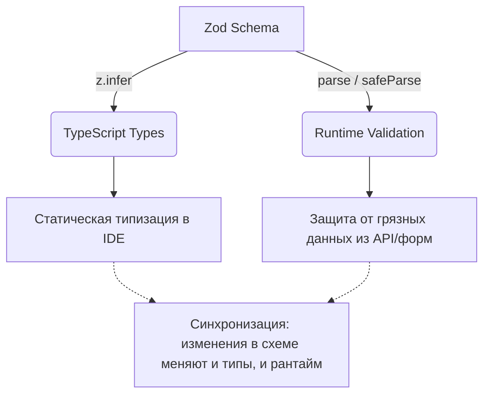

# Zod

## Суть концепции

Zod — это библиотека для декларативного описания схем данных с подходом Schema-First. Вы описываете структуру данных один раз с помощью удобного API (цепочки вызовов, fluent API), а затем получаете "два в одном": надежную валидацию в рантайме и автоматически выведенные (inferred) статические типы TypeScript.

Он решает боль постоянного рассинхрона между TS-интерфейсами и логикой проверки данных (например, когда вы написали `interface User`, а потом пишете вручную функцию `validateUser`, и при добавлении нового поля забываете обновить функцию). Zod делает схему единым источником истины.

## Архитектурная схема



## Как это выглядит в коде

**Антипаттерн (Дублирование логики и типов):**
```typescript
interface User {
  id: string;
  email: string;
}

function validateUser(data: any): data is User {
  return typeof data.id === 'string' && 
         typeof data.email === 'string' && 
         data.email.includes('@');
}
```

**Как надо делать (Zod Schema-First подход):**
```typescript
import { z } from 'zod';

// Единый источник истины
const UserSchema = z.object({
  id: z.string().uuid(),
  email: z.string().email(),
});

// TypeScript тип достается бесплатно
type User = z.infer<typeof UserSchema>;

// Безопасный парсинг без выброса исключений (Control Flow через Either-like паттерн)
function processData(unknownData: unknown) {
  const result = UserSchema.safeParse(unknownData);
  
  if (!result.success) {
    console.error("Ошибки валидации:", result.error.format());
    return;
  }
  
  // result.data имеет строго выведенный тип User
  console.log(result.data.email);
}
```

## Неочевидные нюансы и границы применимости

1. **Размер бандла:** Zod использует классы и возвращает `this` для обеспечения fluent API. Это означает, что сборщики не могут вырезать неиспользуемые методы (tree-shaking не работает). Включив Zod в проект, вы добавляете к бандлу фронтенда около 40-50 KB (minified), что может быть критично для виджетов или лендингов.
2. **Тяжелые цепочки вызовов:** Иногда сложные схемы валидации со множеством `refine` и `transform` становятся настолько сложными, что TypeScript начинает тормозить при выводе типов (Type Instantiation is excessively deep and possibly infinite).
3. **Глобальная экосистема:** Zod настолько популярен, что стал "лингва-франка" во фронтенд-архитектуре. Его нативно поддерживают React Hook Form, tRPC, Remix и многие другие библиотеки. Отказ от Zod в пользу более легковесных альтернатив (Valibot) означает отказ от огромной экосистемы готовых интеграций.
