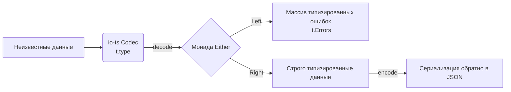

# io-ts

## Суть концепции

io-ts — это библиотека для runtime-валидации и декодирования, основанная на строгих математических принципах функционального программирования (ФП). Она тесно интегрирована с экосистемой `fp-ts`. В отличие от Zod или Valibot, которые фокусируются на "проверке" данных, io-ts использует концепцию *Кодеков* (Codecs), которые могут одновременно декодировать (unknown -> Type) и кодировать (Type -> unknown) данные.

io-ts решает боль непредсказуемой обработки ошибок и нечистых функций при валидации. Вместо того чтобы выбрасывать исключения (`throw`), io-ts всегда возвращает структуру данных (монаду `Either`), которая явно указывает, успешно ли прошло декодирование, заставляя программиста на уровне типов обработать оба сценария.

## Архитектурная схема



## Как это выглядит в коде

**Как надо делать (Функциональный подход с io-ts):**
```typescript
import * as t from 'io-ts';
import { isRight } from 'fp-ts/Either';

// Создаем кодек (схему)
const UserCodec = t.type({
  id: t.number,
  name: t.string
});

// Выводим тип (аналог z.infer)
type User = t.TypeOf<typeof UserCodec>;

function processNetworkResponse(rawData: unknown) {
  // Декодируем данные. Возвращается Either<Errors, User>
  const result = UserCodec.decode(rawData);

  // Мы обязаны проверить успешность через ФП-утилиты
  if (isRight(result)) {
    // В ветке isRight мы достаем данные из свойства right
    const user = result.right;
    console.log(user.name.toUpperCase());
  } else {
    // В ветке left лежат детализированные ошибки
    console.error("Ошибки парсинга:", result.left);
  }
}
```

## Неочевидные нюансы и границы применимости

1. **Крутая кривая обучения:** io-ts требует понимания базовых концепций ФП (Either, Option, Monads) и затягивает в проект зависимость `fp-ts`. Если команда не знакома с функциональным программированием, использование io-ts приведет к огромному когнитивному сопротивлению.
2. **Сложность кастомных сообщений об ошибках:** В отличие от Zod (`z.string({ required_error: "Обязательно" })`), формирование красивых человекочитаемых ошибок в io-ts — это нетривиальная задача, требующая написания отдельных репортеров (Reporters) для обхода AST ошибок.
3. **Границы применимости:** Идеальный выбор для проектов, которые *уже* используют функциональный подход и библиотеку `fp-ts` по всей кодовой базе. В классических ООП или императивных React-приложениях io-ts будет выглядеть чужеродно и избыточно сложно по сравнению с Zod/Valibot.
